# Advanced Memcached Profiling on Hybrid Architecture

---

## Overview of Profiling Scenarios

This document presents a deep-dive performance analysis of Memcached using Hardware Performance Counters and FlameGraphs. The profiling is divided into two primary categories to evaluate different aspects of the system:

1. **Concurrency and Scalability Scenarios (s1c1 to s4c4):** Evaluates how Memcached scales across multiple threads and CPU cores, focusing on locking contention, cache locality, and IPC (Instructions Per Cycle) degradation under different client-server thread topologies.
2. **Workload Characteristic Scenarios (Set:Get Ratios):** Analyzes the architectural impact of varying Read/Write ratios (Read-Heavy, Balanced, Write-Heavy) on single-thread execution, focusing on branch prediction failures, cache thrashing, and TLB overhead.

**Primary Goal:** To identify hardware-level bottlenecks (Memory Wall, CPU pipelines, Cache hierarchy) in an in-memory Key-Value store under diverse operational stress conditions on a modern Hybrid CPU architecture.

---

## Hardware Topology Analysis


The environment utilizes a hybrid processor architecture featuring $12$ Processing Units (PUs) and $15$ GB of RAM unified under a single NUMA node. The core configuration is as follows:

- **Performance Cores (P-Cores):** $4$ physical cores (Core L0 to L3). Each core possesses a dedicated L2 cache ($1280$ KB) and supports Hyper-Threading, providing a total of $8$ logical processors (PU $0$ to PU $7$).
- **Efficient Cores (E-Cores):** $4$ physical cores (Core L4 to L7) without Hyper-Threading (providing $4$ logical processors: PU $8$ to PU $11$). These cores share a single, unified L2 cache ($2048$ KB).
- **Shared L3 Cache:** A $12$ MB Level $3$ cache shared uniformly across all P-Cores and E-Cores.

### Hardware Performance Counters & Metric Selection

The selected events with the `u/` suffix (User-space) measure various aspects of CPU performance:
- `cycles/u` & `instructions/u`: CPU cycles and executed instructions (used to calculate IPC and core efficiency).
- `L1-dcache-loads/u`, `L1-dcache-load-misses/u` & `L1-dcache-stores/u`: L1 data cache accesses (loads, misses, and stores), indicating the volume of data processing.
- `L1-icache-load-misses/u`: L1 instruction cache misses, showing delays in instruction fetching.
- `l2_rqsts.references/u` & `l2_rqsts.miss/u`: Level-2 cache requests and misses, acting as the bridge between L1 and LLC.
- `LLC-loads/u`, `LLC-load-misses/u`, `LLC-stores/u` & `LLC-store-misses/u`: Last Level Cache (L3) accesses and misses for both load and store operations. LLC misses result in high-latency RAM access.
- `dTLB-loads/u`, `dTLB-load-misses/u`, `dTLB-stores/u` & `dTLB-store-misses/u`: Data TLB performance in virtual-to-physical address translation for both memory read and write accesses.
- `branch-misses/u`: Branch prediction failures causing pipeline flushes.

> **Note on Precision:** CPUs feature a limited number of Hardware Performance Counters. Requesting too many simultaneous events forces `perf` to use Time Multiplexing, resulting in estimated values (indicated by $<100\%$ time coverage). By splitting the events into two distinct groups, it was ensured that the hardware counter limits were not exceeded, guaranteeing that all metrics were recorded with $100\%$ absolute precision, eliminating statistical estimations.

---

## Part 1: Concurrency and Scalability Scenarios (Overall Purpose)

The primary goal of these $4$ scenarios is to evaluate the scalability and architectural behavior of Memcached under varying workloads. 

### Summary of the 4 Scenarios

- **Scenario A (1 Server vs 1 Client - 1v1):** The Baseline. Evaluates Memcached’s raw single-thread performance without any inter-thread synchronization overhead or contention.
- **Scenario B (1 Server vs 4 Clients - 1v4):** Single-thread Stress Test. Pushes a single Memcached thread to its absolute limits by generating heavy concurrent load from multiple client cores to identify the bottleneck point.
- **Scenario C (4 Servers vs 1 Client - 4v1):** Synchronization Overhead Test. Tests how a multi-threaded Memcached server behaves under a light load. It helps identify overheads caused by thread locking and internal management when parallel processing isn’t strictly necessary.
- **Scenario D (4 Servers vs 4 Clients - 4v4):** Full Scalability Test. Evaluates Memcached’s true parallel processing capabilities under heavy load, revealing how well it scales across multiple P-Cores and how it utilizes the shared L3 cache.

---

## Scenario 1: 1 Server Thread vs. 1 Client Thread (1v1)

### Step 1: Initializing the Memcached Server (Terminal 1)
```bash
taskset -c 2 memcached -p 11211 -t 1 -u root
```

We start the Memcached server as the root user on port $11211$, strictly limiting it to a single thread (`-t 1`).
- **CPU Topology Context:** We used `taskset -c 2` to pin the process to Processing Unit (PU) $2$. According to our hardware topology (`lstopo`), PU $2$ is located on Core L$1$, which is a Performance Core (P-Core). Pinning the process ensures cache locality (L1/L2 caches) and prevents the OS scheduler from migrating the process, which would pollute the CPU cache.

### Step 2: Generating Load with Memtier Benchmark (Terminal 4)
```bash
taskset -c 8 memtier_benchmark -s 127.0.0.1 -p 11211 -P memcache_binary -t 1 -c 50 -n 100000 --ratio=1:1 --key-pattern=R:R
```

This command launches the client to simulate traffic. It creates $1$ thread (`-t 1`) with $50$ connections, sending $100,000$ requests per connection with an equal Read/Write ratio (`--ratio=1:1`).
- **CPU Topology Context:** We pinned the client to CPU $8$ (`taskset -c 8`). Based on the topology, PU $8$ is located on Core L4, which is an Efficient Core (E-Core). By placing the client on a completely isolated physical core and a different core cluster, we guarantee that the load generator does not compete with Memcached for L1/L2/L3 caches or CPU cycles.

### Step 3: Hardware Event Counting (Terminal 2)
```bash
sudo perf stat -p $(pidof memcached) \
  -e cpu_core/cycles/u \
  -e cpu_core/instructions/u \
  -e cpu_core/L1-dcache-loads/u \
  -e cpu_core/L1-dcache-load-misses/u \
  -e cpu_core/l2_rqsts.references/u \
  -e cpu_core/l2_rqsts.miss/u \
  -e cpu_core/branch-misses/u
```
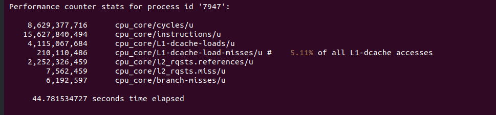
```bash
sudo perf stat -p $(pidof memcached) \
  -e cpu_core/LLC-loads/u \
  -e cpu_core/LLC-load-misses/u \
  -e cpu_core/dTLB-loads/u \
  -e cpu_core/dTLB-load-misses/u
```
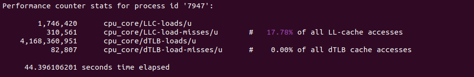


While the benchmark was running, we executed `perf stat` sequentially to count exact hardware events.

### Step 4: Profiling with Perf Record

Simultaneously (in another test run), we captured profiling data using `perf record` to map the events to source code functions via frame pointers (`--call-graph fp`).
```bash
sudo perf record -p $(pidof memcached) \
-e cpu_core/cycles/u,cpu_core/instructions/u,cpu_core/L1-dcache-loads/u,cpu_core/L1-dcache-load-misses/u,cpu_core/l2_rqsts.references/u,cpu_core/l2_rqsts.miss/u,cpu_core/branch-misses/u \
-g --call-graph fp \
-o perf_cache.data
```
```bash
sudo perf record -p $(pidof memcached) \
-e cpu_core/LLC-loads/u,cpu_core/LLC-load-misses/u,cpu_core/dTLB-loads/u,cpu_core/dTLB-load-misses/u \
-g --call-graph fp \
-o perf_tlb_os.data
```

### FlameGraph Analysis (1v1 Scenario)

#### 1. CPU Cycles Analysis

[](https://raw.githack.com/Ayda-R/memcached-benchmark/refs/heads/main/images4/multi-thread/1flame_cache_cpu_core_cycles_u.svg)
- **Main Hotspot:** The `drive_machine` function, leading into `process_command` and `assoc_find`.
- **Reason & Functionality:** Memcached uses an event-driven architecture. `drive_machine` is the core event loop. The CPU spends most of its time in `process_command` (parsing client requests like GET/SET) and `assoc_find` (looking up the key in the hash table). This is a sign of a healthy architecture where CPU cycles are spent on the core business logic rather than overhead.

#### 2. Last Level Cache (LLC) Misses Analysis

[](https://raw.githack.com/Ayda-R/memcached-benchmark/refs/heads/main/images4/multi-thread/1flame_cache_cpu_core_LLC-load-misses_u.svg)
- **Main Hotspot:** The `assoc_find` function.
- **Reason & Functionality:** `assoc_find` traverses the large Memcached hash table. Due to the random access nature of key lookups, the required memory addresses are rarely found in the CPU’s Last-Level Cache (L3). This results in Cache Misses, forcing the CPU to fetch data directly from the slower Main Memory (RAM), which is the primary performance bottleneck for in-memory stores.

#### 3. Data TLB Misses Analysis

[](https://raw.githack.com/Ayda-R/memcached-benchmark/refs/heads/main/images4/multi-thread/1flame_tlb_os_cpu_core_dTLB-load-misses_u.svg)
- **Main Hotspot:** Item retrieval (`do_item_get`) and lookup functions (`assoc_find`).
- **Reason & Functionality:** The TLB (Translation Lookaside Buffer) is a small cache for virtual-to-physical address translations. Because Memcached accesses scattered memory locations (different memory pages) across a huge memory pool, the TLB capacity is frequently exceeded. TLB misses force the CPU to perform costly Page Table Walks, adding OS-level overhead to memory lookups.

---

## Scenario 2: 1 Server Thread vs. 4 Client Threads (1v4)

In this scenario, the goal is to evaluate the performance of a single server core (Memcached) under high load generated by multiple client threads.

### Server Setup (Terminal 1)
```bash
taskset -c 2 memcached -p 11211 -t 1 -u root
```

Existing services were stopped first. Then, Memcached was launched using `taskset` pinned strictly to logical processor $2$ with a single thread (`-t 1`).
- Core number $2$ is a Performance Core (P-Core). We pin the server here to ensure it gets maximum processing power and full access to the large L3 cache.

### Client Setup (Terminal 4)
```bash
taskset -c 8,9,10,11 memtier_benchmark -s 127.0.0.1 -p 11211 -P memcache_binary -t 4 -c 50 -n 100000 --ratio=1:1 --key-pattern=R:R
```

The `memtier_benchmark` tool was executed with $4$ threads (`-t 4`) and pinned to logical processors $8$, $9$, $10$, and $11$.
- Cores $8$ through $11$ are Efficiency Cores (E-Cores). By placing the client threads on these cores, we completely isolate the load generator from the server. This prevents resource contention and ensures the clients do not pollute the P-Core’s cache or steal CPU cycles from the server.

### Gathering Overall Stats with `perf stat` (Terminal 2)
```bash
sudo perf stat -p $(pidof memcached) \
  -e cpu_core/cycles/u \
  -e cpu_core/instructions/u \
  -e cpu_core/L1-dcache-loads/u \
  -e cpu_core/L1-dcache-load-misses/u \
  -e cpu_core/l2_rqsts.references/u \
  -e cpu_core/l2_rqsts.miss/u \
  -e cpu_core/branch-misses/u
```
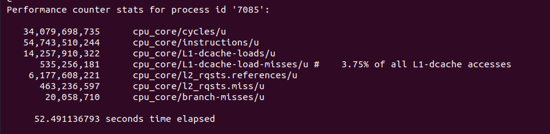
```bash
sudo perf stat -p $(pidof memcached) \
  -e cpu_core/LLC-loads/u \
  -e cpu_core/LLC-load-misses/u \
  -e cpu_core/dTLB-loads/u \
  -e cpu_core/dTLB-load-misses/u
```
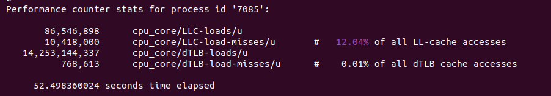

Concurrently with the benchmark, `perf stat` was attached to the Memcached Process ID. It was run in two separate groups to collect overall hardware event statistics (such as CPU cycles, cache misses, and TLB misses) during the benchmark run.

### Profiling Events with `perf record` (Terminal 3)

To generate FlameGraphs later, `perf record` was used to capture detailed call graphs. To avoid time-multiplexing inaccuracies due to limited hardware performance counters, this command was executed in two separate runs: one for CPU/Cache events and another for TLB/OS events.
```bash
sudo perf record -p $(pidof memcached) \
-e cpu_core/cycles/u,cpu_core/instructions/u,cpu_core/L1-dcache-loads/u,cpu_core/L1-dcache-load-misses/u,cpu_core/l2_rqsts.references/u,cpu_core/l2_rqsts.miss/u,cpu_core/branch-misses/u \
-g --call-graph fp \
-o perf_cache.data
```
```bash
sudo perf record -p $(pidof memcached) \
-e cpu_core/LLC-loads/u,cpu_core/LLC-load-misses/u,cpu_core/dTLB-loads/u,cpu_core/dTLB-load-misses/u \
-g --call-graph fp \
-o perf_tlb_os.data
```

### FlameGraph Analysis (1v4 Scenario)

#### Branch Misses - Pipeline Stalls
[](https://raw.githack.com/Ayda-R/memcached-benchmark/refs/heads/main/images4/multi-thread/2flame_tlb_os_cpu_core_branch-misses_u.svg)

High concurrency introduces unpredictable execution paths, especially during command parsing and state machine transitions in `drive_machine`. Branch prediction failures cause pipeline flushes, wasting CPU cycles. Optimizing conditional checks in the hot paths could theoretically reduce this overhead, though it is a common characteristic of complex network servers.

---

## Scenario 3: Multi-Threaded Server (4 Threads) vs Isolated Client (4v1)

This scenario evaluates the performance of Memcached when utilizing multiple worker threads, with strict CPU affinity to isolate the server from the load generator.

### Server Initialization (Terminal 1)
```bash
taskset -c 0,2,4,6 memcached -p 11211 -t 4 -u root
```

We start the Memcached instance with $4$ worker threads (`-t 4`). Using `taskset`, we pin the process to CPU cores $0$, $2$, $4$, $6$. Based on the Intel hybrid topology, these are independent Performance Cores (P-Cores). Pinning to specific physical P-Cores avoids Hyper-Threading contention (by skipping SMT sibling cores like $1$, $3$, $5$, $7$) and prevents context-switching overhead, ensuring maximum processing power and cache locality for the server.

### Client Load Generation (Terminal 4)
```bash
taskset -c 8 memtier_benchmark -s 127.0.0.1 -p 11211 -P memcache_binary -t 1 -c 50 -n 100000 --ratio=1:1 --key-pattern=R:R
```

The `memtier_benchmark` client is launched with $4$ threads to generate high traffic. It is pinned to CPU cores $8$, $9$, $10$, $11$. In our topology, these represent the Efficiency Cores (E-Cores). This strict isolation guarantees that the load generator does not interfere with the server’s P-Cores, preventing Resource Contention and ensuring benchmark accuracy.

### Hardware Performance Counters `perf stat` (Terminal 2)
```bash
sudo perf stat -p $(pidof memcached) \
  -e cpu_core/cycles/u \
  -e cpu_core/instructions/u \
  -e cpu_core/L1-dcache-loads/u \
  -e cpu_core/L1-dcache-load-misses/u \
  -e cpu_core/l2_rqsts.references/u \
  -e cpu_core/l2_rqsts.miss/u \
  -e cpu_core/branch-misses/u
```
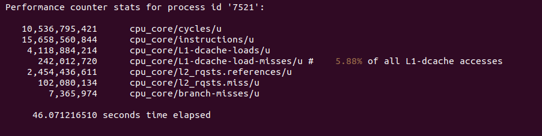
```bash
sudo perf stat -p $(pidof memcached) \
  -e cpu_core/LLC-loads/u \
  -e cpu_core/LLC-load-misses/u \
  -e cpu_core/dTLB-loads/u \
  -e cpu_core/dTLB-load-misses/u
```
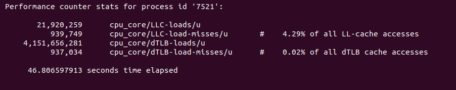

Concurrently with the benchmark, we run `perf stat -p $(pidof memcached)` to monitor the running server process. The command is split into two executions to capture hardware events without multiplexing issues:
1. Cache & Core metrics (cycles, instructions, L1/LLC loads and misses).
2. TLB & OS metrics (dTLB misses, branch-misses, page-faults).

### Call Graph Profiling `perf record` (Terminal 3)

To generate FlameGraphs for deep function-level analysis, we use `perf record -p $(pidof memcached) -g --call-graph fp`. This samples the call stack of the application. Like `perf stat`, it is executed in two separate runs to group relevant events:
- Captures cache-related events and outputs to `perf_cache.data`.
- Captures TLB/Branch events and outputs to `perf_tlb_os.data`.
```bash
sudo perf record -p $(pidof memcached) \
-e cpu_core/cycles/u,cpu_core/instructions/u,cpu_core/L1-dcache-loads/u,cpu_core/L1-dcache-load-misses/u,cpu_core/l2_rqsts.references/u,cpu_core/l2_rqsts.miss/u,cpu_core/branch-misses/u \
-g --call-graph fp \
-o perf_cache.data
```
```bash
sudo perf record -p $(pidof memcached) \
-e cpu_core/LLC-loads/u,cpu_core/LLC-load-misses/u,cpu_core/dTLB-loads/u,cpu_core/dTLB-load-misses/u \
-g --call-graph fp \
-o perf_tlb_os.data
```

### FlameGraph Analysis (4v1 Scenario)

#### LLC Misses
[](https://raw.githack.com/Ayda-R/memcached-benchmark/refs/heads/main/images4/multi-thread/3flame_cache_cpu_core_LLC-load-misses_u.svg)
- **Importance:** For data-intensive applications like Memcached, main memory access is the primary bottleneck (the Memory Wall). This graph highlights where data was not found in the L3 cache.
- **Main Hotspot:** `assoc_find` and `item_get`.
- **Reason & Analysis:** The `assoc_find` function is responsible for hash table lookups. Because the hash table relies on arrays of pointers and linked lists scattered across memory (pointer chasing), the CPU’s hardware prefetcher cannot easily predict memory access patterns. This random access behavior leads to significant Last Level Cache (LLC) misses.

---

## Scenario 4: Full Scalability Test (4v4)

### Starting the Memcached Server (Terminal 1)
```bash
taskset -c 0,2,4,6 memcached -p 11211 -t 4 -u root
```

First, we stopped any running memcached services (`systemctl stop` and `killall`), then executed the following command:
Using `taskset`, we pinned the memcached process to CPUs $0$, $2$, $4$, $6$. The port is set to $11211$, and we used the `-t 4` flag to run memcached with $4$ threads.
According to the system topology, cores $0$, $2$, $4$, and $6$ are Performance Cores (P-Cores). We placed the $4$ server threads exactly on $4$ dedicated P-Cores to ensure the server has maximum processing power to handle concurrent requests and to prevent thread migration.

### Launching the Client (Terminal 4)
```bash
taskset -c 8,9,10,11 memtier_benchmark -s 127.0.0.1 -p 11211 -P memcache_binary -t 4 -c 50 -n 100000 --ratio=1:1 --key-pattern=R:R
```

To generate traffic load, we executed the `memtier_benchmark`. This runs a benchmark using $4$ threads (`-t 4`), $50$ connections per thread (`-c 50`), and $100,000$ requests per client.
Cores $8$, $9$, $10$, and $11$ are Efficient Cores (E-Cores) in this topology. By pinning the client to E-Cores, we completely isolated the client and server at the hardware level. This prevents resource contention, ensuring that the profiling results for the server are accurate and noise-free.

### Statistics with `perf stat` (Terminal 2)
```bash
sudo perf stat -p $(pidof memcached) \
  -e cpu_core/cycles/u \
  -e cpu_core/instructions/u \
  -e cpu_core/L1-dcache-loads/u \
  -e cpu_core/L1-dcache-load-misses/u \
  -e cpu_core/l2_rqsts.references/u \
  -e cpu_core/l2_rqsts.miss/u \
  -e cpu_core/branch-misses/u
```
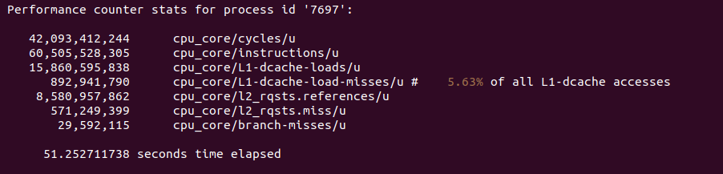
```bash
sudo perf stat -p $(pidof memcached) \
  -e cpu_core/LLC-loads/u \
  -e cpu_core/LLC-load-misses/u \
  -e cpu_core/dTLB-loads/u \
  -e cpu_core/dTLB-load-misses/u
```
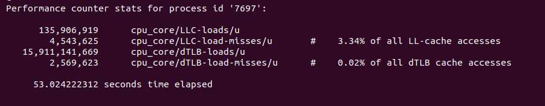

Simultaneously with the benchmark, we ran `perf stat` attached to the memcached PID in this terminal. The command was executed in two separate groups to avoid hardware counter multiplexing. The overall results, including cycle counts, instructions, cache misses, and TLB misses, are visible in the screenshot, providing a high-level hardware summary during the test.

### Recording Events with `perf record` (Terminal 3)

While the load was being generated, we captured detailed profiling data in this terminal to generate FlameGraphs:
Command Explanation: `perf record -p $(pidof memcached)` attaches to the memcached process. The `-e` flag specifies the target events (split into Cache/Core and TLB/OS groups). The critical part is `-g --call-graph fp`, which records the call stacks using frame pointers, enabling us to build accurate FlameGraphs. The output is saved to `.data` files (e.g., `perf_cache.data`).
```bash
sudo perf record -p $(pidof memcached) \
-e cpu_core/cycles/u,cpu_core/instructions/u,cpu_core/L1-dcache-loads/u,cpu_core/L1-dcache-load-misses/u,cpu_core/l2_rqsts.references/u,cpu_core/l2_rqsts.miss/u,cpu_core/branch-misses/u \
-g --call-graph fp \
-o perf_cache.data
```
```bash
sudo perf record -p $(pidof memcached) \
-e cpu_core/LLC-loads/u,cpu_core/LLC-load-misses/u,cpu_core/dTLB-loads/u,cpu_core/dTLB-load-misses/u \
-g --call-graph fp \
-o perf_tlb_os.data
```

### FlameGraph Analysis (4v4 Scenario)

#### CPU Cycles
[](https://raw.githack.com/Ayda-R/memcached-benchmark/refs/heads/main/images4/multi-thread/4flame_cache_cpu_core_cycles_u.svg)
This graph provides the baseline overview of where the CPU spends its actual execution time. It shows the overall cost of functions.
- **Main Hotspot:** `drive_machine`
- **Why it’s dominant:** This is the core state machine and event loop of Memcached. Every network event, client connection, and command parsing goes through this function. Under high load (like 4v4 scenarios), managing the state of thousands of concurrent connections keeps the CPU constantly busy executing instructions within this loop.

---

## Performance Analysis and Scenario Comparison

| Event (Performance Counter) | `1 server & 1 client` | `1 server & 4 clients` | `4 servers & 1 client` | `4 servers & 4 clients` |
| :--- | :--- | :--- | :--- | :--- |
| **cpu_core/cycles/u** | $8,629,377,716$ | $34,079,698,735$ | $10,536,795,421$ | $42,093,412,244$ |
| **cpu_core/instructions/u** | $15,627,840,494$ | $54,743,510,244$ | $15,658,560,844$ | $60,505,528,305$ |
| **cpu_core/L1-dcache-loads/u** | $4,115,067,684$ | $14,257,910,322$ | $4,118,884,214$ | $15,860,595,838$ |
| **cpu_core/L1-dcache-load-misses/u** | $210,110,486$ ($5.11\%$) | $535,256,181$ ($3.75\%$) | $242,012,720$ ($5.88\%$) | $892,941,790$ ($5.63\%$) |
| **cpu_core/l2_rqsts.references/u** | $2,252,326,459$ | $6,177,608,221$ | $2,454,436,611$ | $8,580,957,862$ |
| **cpu_core/l2_rqsts.miss/u** | $7,562,459$ | $463,236,597$ | $102,080,134$ | $571,249,399$ |
| **cpu_core/branch-misses/u** | $6,192,597$ | $20,058,710$ | $7,365,974$ | $29,592,115$ |
| **cpu_core/LLC-loads/u** | $1,746,420$ | $86,546,898$ | $21,920,259$ | $135,906,919$ |
| **cpu_core/LLC-load-misses/u** | $310,561$ ($17.78\%$) | $10,418,000$ ($12.04\%$) | $939,749$ ($4.29\%$) | $4,543,625$ ($3.34\%$) |
| **cpu_core/dTLB-loads/u** | $4,168,360,951$ | $14,253,144,337$ | $4,151,656,281$ | $15,911,141,669$ |
| **cpu_core/dTLB-load-misses/u** | $82,807$ ($0.00\%$) | $768,613$ ($0.01\%$) | $937,034$ ($0.02\%$) | $2,569,623$ ($0.02\%$) |

### 1. Execution Efficiency & IPC (Cycles vs. Instructions)
By calculating the Instructions Per Cycle (IPC = Instructions / Cycles), we can observe how the CPU execution efficiency degrades under contention:

- **1v1 (Baseline):** IPC $\approx 1.81$
- **1v4 (Stress):** IPC $\approx 1.60$
- **4v1 (Sync Overhead):** IPC $\approx 1.48$
- **4v4 (Full Scale):** IPC $\approx 1.43$

**Root Cause:** The drop in IPC, especially in scenarios C (4v1) and D (4v4), is a direct result of Lock Contention. When multiple Memcached threads try to access the shared hash table, synchronization mechanisms (like mutexes or spinlocks) force cores to waste cycles waiting, thereby lowering the overall instruction throughput per cycle.

### 2. L1 Data Cache Performance
The L1-dcache miss rate remains remarkably stable and low across all scenarios, ranging from $3.75\%$ to $5.88\%$.

**Root Cause:** Memcached’s internal data structures (primarily its hash table and linked lists for LRU) are highly optimized for spatial locality. Interestingly, the 1v4 scenario has the lowest L1 miss rate ($3.75\%$). This happens because a single server thread is being hammered with requests, causing the hottest data to remain pinned and constantly reused in that specific core’s L1 cache.

### 3. L2 Cache Performance (The Intermediary Buffer)
The L2 cache acts as a critical bridge between the highly localized L1 and the shared LLC. It handles the memory requests that slip through the L1 cache.

**Root Cause:** While L1 absorbs the immediate “hot” data (like active hash table buckets), the L2 cache efficiently captures secondary structures (e.g., larger values or slightly colder keys). In Memcached, an effective L2 cache prevents the shared L3 (LLC) from being overwhelmed by traffic. During the transition from 1v1 to 4v4, the L2 cache acts as a protective shield for each individual core, keeping the core-specific data close and minimizing the latency penalty before requests are forced out to the shared LLC.

### 4. Last Level Cache (LLC) - The “Warm Cache” Phenomenon
A fascinating observation is the inverse relationship between system load and LLC miss percentage:

- **1v1:** $17.78\%$ miss rate
- **4v4:** $3.34\%$ miss rate

**Root Cause:** In low-load scenarios (1v1), cache lines are more susceptible to being evicted by the OS or background tasks before they are accessed again. Under heavy parallel load (4v4), the massive volume of concurrent requests to the same Memcached key space keeps the shared L3 cache “warm”. The data is accessed so frequently that it never gets a chance to be evicted, drastically improving the LLC hit rate.

### 5. TLB (Translation Lookaside Buffer) Efficiency
The dTLB miss rate is virtually zero across all tests (max $0.02\%$).

**Root Cause:** This highlights the brilliance of Memcached’s Slab Allocator. Instead of frequently calling `malloc()`/`free()`, Memcached pre-allocates large memory chunks and manages them internally. This drastically reduces memory fragmentation and maximizes TLB page reuse, effectively eliminating virtual-to-physical translation bottlenecks.

---

## Part 2: Performance Analysis under Different Read/Write Workloads (Set:Get Ratios)

### Objective and Purpose
The goal of this scenario is to evaluate Memcached’s performance and architectural behavior under varying workload characteristics. Real-world applications rarely have a static access pattern; therefore, testing different set (write) to get (read) ratios is crucial to understand system bottlenecks.

We test three specific ratios:
1. **$10:90$ ($10\%$ Set, $90\%$ Get):** Simulates a typical read-heavy caching workload (e.g., serving static content, user profiles). This tests the efficiency of the hash table lookups and cache hits.
2. **$50:50$ ($50\%$ Set, $50\%$ Get):** Simulates a balanced workload. This tests the system’s ability to handle frequent cache invalidations and memory allocations simultaneously with read requests.
3. **$90:10$ ($90\%$ Set, $10\%$ Get):** Simulates a write-heavy workload (e.g., session management, real-time analytics). This puts heavy stress on memory allocation, eviction policies (LRU), and internal locking mechanisms.

### Server Setup (Terminal 1)
This setup remains constant across all three ratio tests.
To ensure isolated and accurate profiling, we first stop any background instances of Memcached and then launch our custom-compiled version pinned to a specific CPU core.
Command executed in Terminal 1:
```bash
taskset -c 2 memcached -P 11211 -t 1 -u root
```

---

### Scenario 1: Balanced Workload (50:50 Set:Get Ratio)
After starting the Memcached server, we utilize two additional terminals to generate the specific workload and simultaneously profile the server’s hardware events.

**Client Setup & Load Generation:**
To simulate a balanced workload where read and write operations are equal, we execute the `memtier_benchmark` tool in Terminal 3.
```bash
taskset -c 8,9,10,11 memtier_benchmark -s 127.0.0.1 -p 11211 -P memcache_binary -t 4 -c 50 -n 100000 --ratio=1:1 --key-pattern=R:R
```

**Concurrent Performance Profiling:**
Exactly while the benchmark is running, we execute `perf stat` commands in Terminal 2 to capture the hardware performance counters of the Memcached process.
```bash
sudo perf stat -p $(pidof memcached) \
  -e cpu_core/cycles/u \
  -e cpu_core/instructions/u \
  -e cpu_core/branch-misses/u \
  -e cpu_core/L1-dcache-loads/u \
  -e cpu_core/L1-dcache-load-misses/u
```
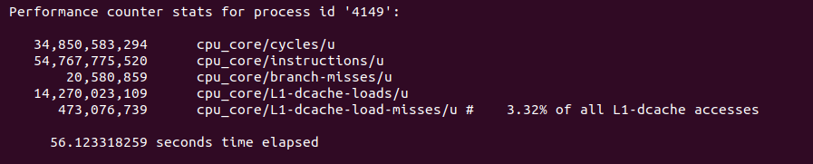
```bash
sudo perf stat -p $(pidof memcached) \
  -e cpu_core/l2_rqsts.references/u \
  -e cpu_core/l2_rqsts.miss/u \
  -e cpu_core/LLC-loads/u \
  -e cpu_core/LLC-load-misses/u
```
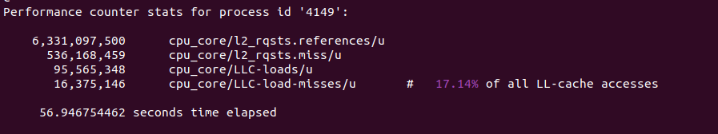
```bash
sudo perf stat -p $(pidof memcached) \
  -e cpu_core/dTLB-stores/u \
  -e cpu_core/dTLB-store-misses/u \
  -e cpu_core/LLC-stores/u \
  -e cpu_core/LLC-store-misses/u \
  -e cpu_core/L1-dcache-stores/u
```
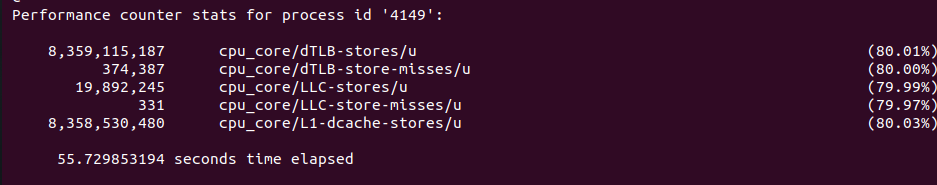


---

### Scenario 2: Read-Heavy Workload (1:9 Set:Get Ratio)
After establishing the Memcached server (pinned to P-Core $2$), we use the remaining terminals to generate a read-intensive workload and concurrently profile the server’s hardware events and execution graphs.

**Client Setup & Load Generation:**
To simulate a workload predominantly consisting of read operations ($90\%$ reads, $10\%$ writes), we execute the `memtier_benchmark` tool.
```bash
taskset -c 8,9,10,11 memtier_benchmark -s 127.0.0.1 -p 11211 -P memcache_binary -t 4 -c 50 -n 100000 --ratio=1:9 --key-pattern=R:R
```

**Concurrent Performance Profiling:**
While the read-heavy benchmark is actively running, we capture both high-level statistical counters and deep-level execution graphs. We use `perf stat` to capture aggregated hardware performance metrics during the workload execution.
```bash
sudo perf stat -p $(pidof memcached) \
  -e cpu_core/cycles/u \
  -e cpu_core/instructions/u \
  -e cpu_core/branch-misses/u \
  -e cpu_core/L1-dcache-loads/u \
  -e cpu_core/L1-dcache-load-misses/u
```
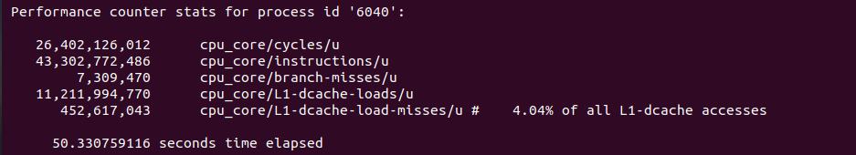
```bash
sudo perf stat -p $(pidof memcached) \
  -e cpu_core/l2_rqsts.references/u \
  -e cpu_core/l2_rqsts.miss/u \
  -e cpu_core/LLC-loads/u \
  -e cpu_core/LLC-load-misses/u
```
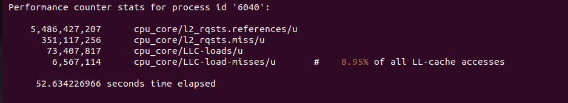
```bash
sudo perf stat -p $(pidof memcached) \
  -e cpu_core/dTLB-stores/u \
  -e cpu_core/dTLB-store-misses/u \
  -e cpu_core/LLC-stores/u \
  -e cpu_core/LLC-store-misses/u \
  -e cpu_core/L1-dcache-stores/u
```
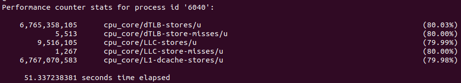

---

### Scenario 3: Write-Heavy Workload (9:1 Set:Get Ratio)
After establishing the Memcached server (pinned to P-Core $2$), we use the remaining terminals to generate a write-intensive workload and concurrently profile the server’s hardware events and execution graphs.

**Client Setup & Load Generation:**
To simulate a workload predominantly consisting of write operations ($90\%$ writes, $10\%$ reads), we execute the `memtier_benchmark` tool.
```bash
taskset -c 8,9,10,11 memtier_benchmark -s 127.0.0.1 -p 11211 -P memcache_binary -t 4 -c 50 -n 100000 --ratio=9:1 --key-pattern=R:R
```

**Concurrent Performance Profiling:**
While the write-heavy benchmark is actively running, we capture both high-level statistical counters and deep-level execution graphs. We use `perf stat` to capture aggregated hardware performance metrics during the workload execution.
```bash
sudo perf stat -p $(pidof memcached) \
  -e cpu_core/cycles/u \
  -e cpu_core/instructions/u \
  -e cpu_core/branch-misses/u \
  -e cpu_core/L1-dcache-loads/u \
  -e cpu_core/L1-dcache-load-misses/u
```
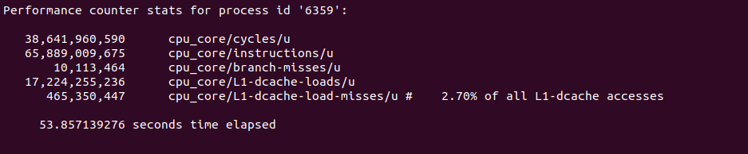
```bash
sudo perf stat -p $(pidof memcached) \
  -e cpu_core/l2_rqsts.references/u \
  -e cpu_core/l2_rqsts.miss/u \
  -e cpu_core/LLC-loads/u \
  -e cpu_core/LLC-load-misses/u
```
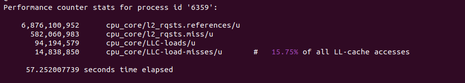
```bash
sudo perf stat -p $(pidof memcached) \
  -e cpu_core/dTLB-stores/u \
  -e cpu_core/dTLB-store-misses/u \
  -e cpu_core/LLC-stores/u \
  -e cpu_core/LLC-store-misses/u \
  -e cpu_core/L1-dcache-stores/u
```
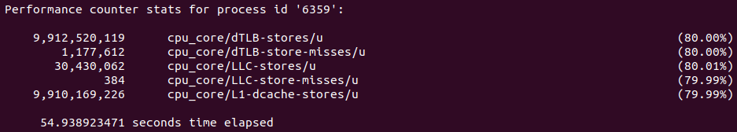

---

### Set:Get Ratios Performance Summary

| Performance Event | Read-Heavy (GET > SET) | Equal (GET = SET) | Write-Heavy (SET > GET) |
| :--- | :--- | :--- | :--- |
| **cycles/u** | $26,402,126,012$ | $34,850,583,294$ | $38,641,960,590$ |
| **instructions/u** | $43,302,772,486$ | $54,767,775,520$ | $65,889,009,675$ |
| **branch-misses/u** | $7,309,470$ | $20,580,859$ | $10,113,464$ |
| **L1-dcache-loads/u** | $11,211,994,770$ | $14,270,023,109$ | $17,224,255,236$ |
| **L1-dcache-load-misses/u** | $452,617,043$ ($4.04\%$) | $473,076,739$ ($3.32\%$) | $465,350,447$ ($2.70\%$) |
| **l2_rqsts.references/u** | $5,486,427,207$ | $6,331,097,500$ | $6,876,100,952$ |
| **l2_rqsts.miss/u** | $351,117,256$ | $536,168,459$ | $582,060,983$ |
| **LLC-loads/u** | $73,407,817$ | $95,565,348$ | $94,194,579$ |
| **LLC-load-misses/u** | $6,567,114$ ($8.95\%$) | $16,375,146$ ($17.14\%$) | $14,838,850$ ($15.75\%$) |
| **L1-dcache-stores/u** | $6,767,070,583$ | $8,358,530,480$ | $9,910,169,226$ |
| **dTLB-stores/u** | $6,765,358,105$ | $8,359,115,187$ | $9,912,520,119$ |
| **dTLB-store-misses/u** | $5,513$ | $374,387$ | $1,177,612$ |
| **LLC-stores/u** | $9,516,105$ | $19,892,245$ | $30,430,062$ |
| **LLC-store-misses/u** | $1,267$ | $331$ | $384$ |


#### 1. Execution Complexity (Instructions & Cycles)

- **Observation:** Write-Heavy executes the highest number of instructions ($\approx 65.8$B) and cycles, while Read-Heavy executes the least ($\approx 43.3$B).
- **Reason:** Processing a SET command in Memcached is inherently more complex. It requires memory allocation via the slab allocator, updating internal metadata, managing eviction (LRU lists), and acquiring locks. A GET command is a simpler hash table lookup and read operation.

#### 2. Branch Predictor Confusion (branch-misses)

- **Observation:** The Equal (1:1) scenario has a massive spike in branch misses ($\approx 20.5$M), double the amount in Write-Heavy and triple that of Read-Heavy.
- **Reason:** The CPU’s branch predictor relies on historical patterns. In pure read or write scenarios, the execution path is predictable. In an Equal scenario, the application constantly alternates between read and write code paths. This unpredictability breaks hardware branch prediction, causing pipeline flushes and performance degradation.

#### 3. Cache Thrashing (LLC-loads & LLC-load-misses)

- **Observation:** The Equal scenario suffers the highest LLC load misses ($\approx 16.3$M / $17.14\%$). Read-Heavy performs best in LLC ($8.95\%$).
- **Reason:** Mixing reads and writes causes Cache Thrashing. Writes modify data and metadata, invalidating cache lines, while reads try to fetch them. This constant push-and-pull evicts useful data from the Last Level Cache much faster than a uniform workload, leading to higher miss rates.

#### 4. Memory Translation Overhead (dTLB-stores & misses)

- **Observation:** Write-Heavy has a catastrophic number of dTLB-store-misses ($\approx 1.17$M), compared to only $5,513$ in Read-Heavy.
- **Reason:** The Data Translation Lookaside Buffer (dTLB) caches virtual-to-physical memory mappings. Writing data (especially allocating new slabs) frequently touches new or unmapped memory pages. The OS must step in to resolve these page faults and update the TLB. Reads, however, usually access existing, already-mapped memory, resulting in near-zero TLB misses.

#### 5. L1 & L2 Cache Pressure (Stores vs. Loads)

- **Observation:** Write-Heavy dominates in L1-dcache-stores ($\approx 9.9$B) and l2_rqsts.miss ($\approx 582$M).
- **Reason:** Writing payloads into Memcached pushes massive amounts of data down the cache hierarchy. The L1 data cache gets quickly filled with new data, forcing evictions to L2, which in turn causes L2 misses when fetching metadata.
```