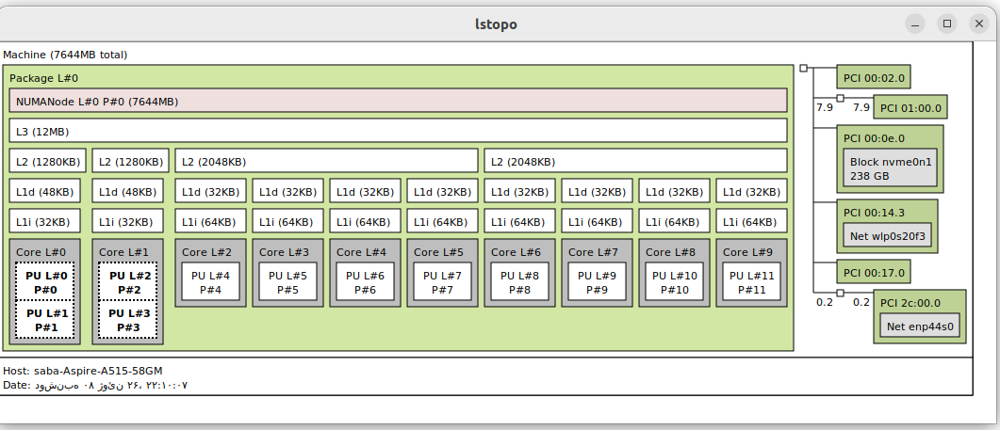
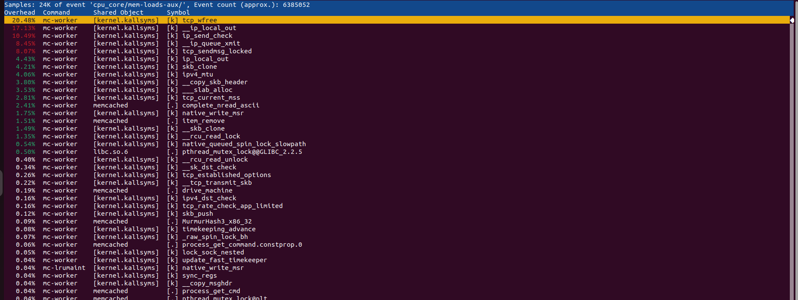
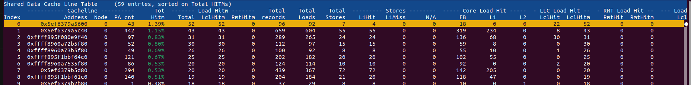
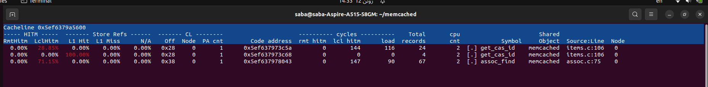
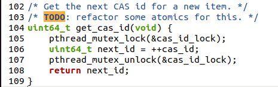
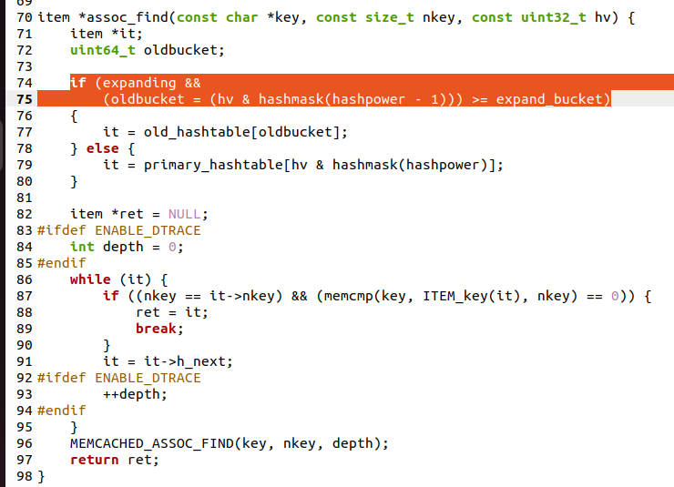
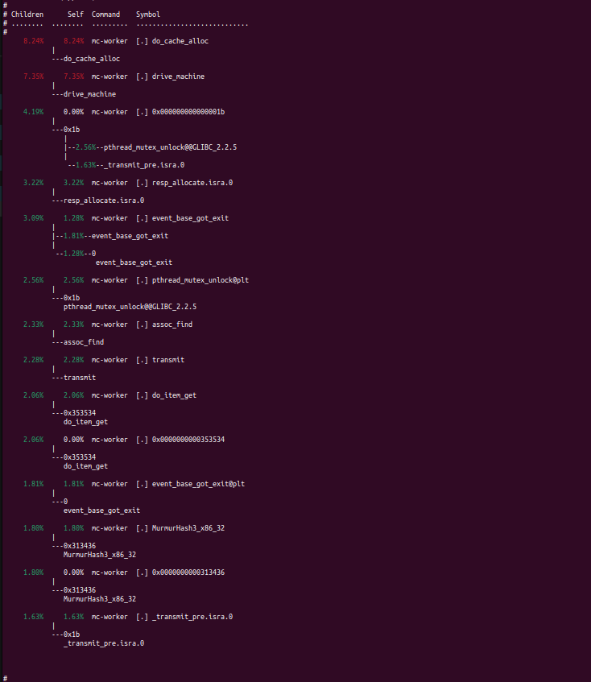
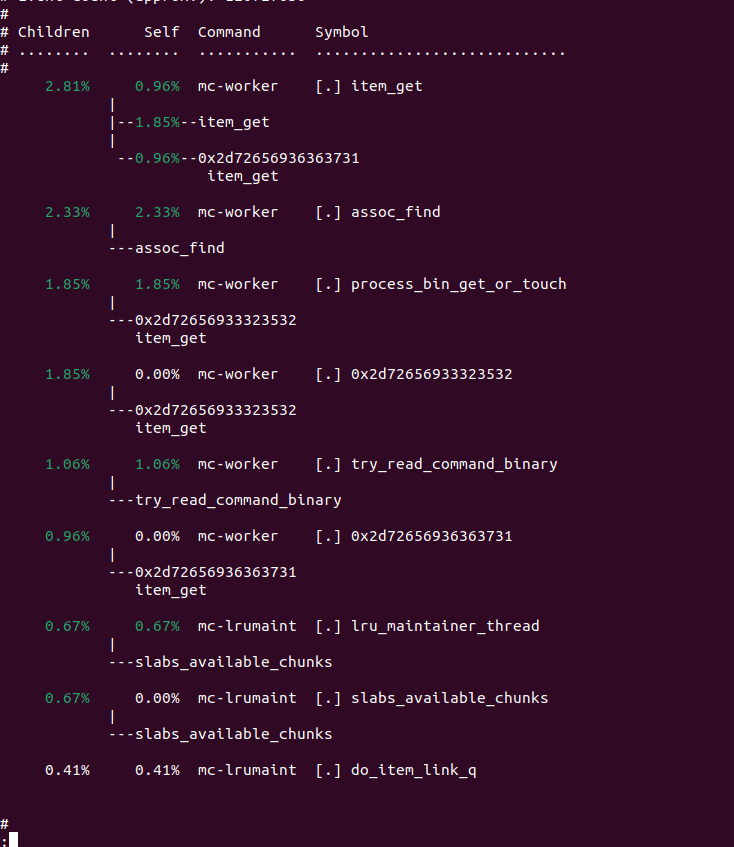
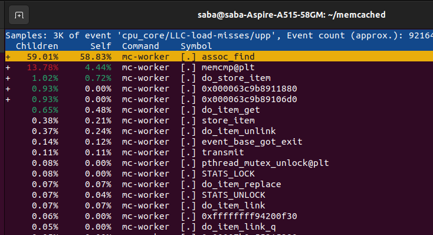

# Memcached Analysis

## Overview

This project investigates behavior on a multicore system using Memcached. The goal is to generate and analyze:

- HITM (Hit Modified) events
- WSS (Working Set Size) behavior

using different CPU affinity configurations and workloads.

## Requirements

- Ubuntu 22.04
- Memcached
- perf
- taskset
- memtier_benchmark
- lstopo

## System Topology



## HITM Experiment

### Objective

Generate cache line sharing between CPU cores to increase HITM events.

### Base Scenario

Run Memcached on only one core:

```bash

#!/bin/bash

MEMCACHED_CORES="1"
CLIENT_CORES="6"
PORT="11211"
DURATION="40"

trap 'echo "Cleaning up..."; kill $MEMCACHED_PID 2>/dev/null' EXIT

echo "Starting memcached on cores $MEMCACHED_CORES..."
taskset -c $MEMCACHED_CORES memcached -u nobody -m 512 -t 2 -l 127.0.0.1 -p $PORT &
MEMCACHED_PID=$!

sleep 3


if ! ss -lntp | grep -q $PORT; then
  echo "Error: memcached failed to start!"
  exit 1
fi

echo "Running perf stat for $DURATION seconds..."

sudo perf stat -p $MEMCACHED_PID \
  -e cpu_core/cycles/uP,cpu_core/instructions/uP,cpu_core/cache-misses/uP,cpu_core/cache-references/uP \
  memtier_benchmark -s 127.0.0.1 -p $PORT \
  --threads=4 --clients=100 --pipeline=1 \
  --protocol=memcache_text \
  --ratio=1:1 \
  --key-pattern=R:R \
  --key-minimum=1 --key-maximum=10 \
  --data-size=64 \
  --test-time=$DURATION \
  --hide-histogram


sudo perf stat -p $MEMCACHED_PID \
  -e cpu_core/mem_load_l3_hit_retired.xsnp_hitm/uP,cpu_core/mem_load_l3_hit_retired.xsnp_miss/uP,cpu_core/mem_load_l3_hit_retired.xsnp_hit/uP \
  memtier_benchmark -s 127.0.0.1 -p $PORT \
  --threads=4 --clients=100 --pipeline=1 \
  --protocol=memcache_text \
  --ratio=1:1 \
  --key-pattern=R:R \
  --key-minimum=1 --key-maximum=10 \
  --data-size=64 \
  --test-time=$DURATION \
  --hide-histogram

sudo perf stat -p $MEMCACHED_PID \
  -e mem_load_retired.l1_hit:uP,mem_load_retired.l2_hit:uP,mem_load_retired.l3_hit:uP \
  memtier_benchmark -s 127.0.0.1 -p $PORT \
  --threads=4 --clients=100 --pipeline=1 \
  --protocol=memcache_text \
  --ratio=1:1 \
  --key-pattern=R:R \
  --key-minimum=1 --key-maximum=10 \
  --data-size=64 \
  --test-time=$DURATION \
  --hide-histogram

sudo perf stat -p $MEMCACHED_PID \
  -e offcore_requests.demand_data_rd,offcore_requests.all_requests \
  memtier_benchmark -s 127.0.0.1 -p $PORT \
  --threads=4 --clients=100 --pipeline=1 \
  --protocol=memcache_text \
  --ratio=1:1 \
  --key-pattern=R:R \
  --key-minimum=1 --key-maximum=10 \
  --data-size=64 \
  --test-time=$DURATION \
  --hide-histogram

echo "Generating background traffic for c2c record..."
memtier_benchmark -s 127.0.0.1 -p $PORT \
  --threads=4 --clients=100 --pipeline=1 \
  --protocol=memcache_text \
  --ratio=1:1 \
  --key-pattern=R:R \
  --key-minimum=1 --key-maximum=10 \
  --data-size=64 \
  --test-time=20 \
  --hide-histogram > /dev/null 2>&1 &
CLIENT_PID=$!

sleep 2

echo "Recording Cache-2-Cache (c2c) data for 10 seconds..."
sudo perf c2c record -p $MEMCACHED_PID -- sleep 10

wait $CLIENT_PID

echo "Test completed. You can now run 'sudo perf c2c report' manually to see the results."

```


### HITM Experiment

Run Memcached on two cores that only share LLC:

```bash

#!/bin/bash

MEMCACHED_CORES="1,3"
CLIENT_CORES="6"
PORT="11211"
DURATION="40"

trap 'echo "Cleaning up..."; kill $MEMCACHED_PID 2>/dev/null' EXIT

echo "Starting memcached on cores $MEMCACHED_CORES..."
taskset -c $MEMCACHED_CORES memcached -u nobody -m 512 -t 2 -l 127.0.0.1 -p $PORT &
MEMCACHED_PID=$!

sleep 3


if ! ss -lntp | grep -q $PORT; then
  echo "Error: memcached failed to start!"
  exit 1
fi

echo "Running perf stat for $DURATION seconds..."

sudo perf stat -p $MEMCACHED_PID \
  -e cpu_core/cycles/uP,cpu_core/instructions/uP,cpu_core/cache-misses/uP,cpu_core/cache-references/uP \
  memtier_benchmark -s 127.0.0.1 -p $PORT \
  --threads=4 --clients=100 --pipeline=1 \
  --protocol=memcache_text \
  --ratio=1:1 \
  --key-pattern=R:R \
  --key-minimum=1 --key-maximum=10 \
  --data-size=64 \
  --test-time=$DURATION \
  --hide-histogram


sudo perf stat -p $MEMCACHED_PID \
  -e cpu_core/mem_load_l3_hit_retired.xsnp_hitm/uP,cpu_core/mem_load_l3_hit_retired.xsnp_miss/uP,cpu_core/mem_load_l3_hit_retired.xsnp_hit/uP \
  memtier_benchmark -s 127.0.0.1 -p $PORT \
  --threads=4 --clients=100 --pipeline=1 \
  --protocol=memcache_text \
  --ratio=1:1 \
  --key-pattern=R:R \
  --key-minimum=1 --key-maximum=10 \
  --data-size=64 \
  --test-time=$DURATION \
  --hide-histogram

sudo perf stat -p $MEMCACHED_PID \
  -e mem_load_retired.l1_hit:uP,mem_load_retired.l2_hit:uP,mem_load_retired.l3_hit:uP \
  memtier_benchmark -s 127.0.0.1 -p $PORT \
  --threads=4 --clients=100 --pipeline=1 \
  --protocol=memcache_text \
  --ratio=1:1 \
  --key-pattern=R:R \
  --key-minimum=1 --key-maximum=10 \
  --data-size=64 \
  --test-time=$DURATION \
  --hide-histogram

sudo perf stat -p $MEMCACHED_PID \
  -e offcore_requests.demand_data_rd,offcore_requests.all_requests \
  memtier_benchmark -s 127.0.0.1 -p $PORT \
  --threads=4 --clients=100 --pipeline=1 \
  --protocol=memcache_text \
  --ratio=1:1 \
  --key-pattern=R:R \
  --key-minimum=1 --key-maximum=10 \
  --data-size=64 \
  --test-time=$DURATION \
  --hide-histogram

echo "Generating background traffic for c2c record..."
memtier_benchmark -s 127.0.0.1 -p $PORT \
  --threads=4 --clients=100 --pipeline=1 \
  --protocol=memcache_text \
  --ratio=1:1 \
  --key-pattern=R:R \
  --key-minimum=1 --key-maximum=10 \
  --data-size=64 \
  --test-time=20 \
  --hide-histogram > /dev/null 2>&1 &
CLIENT_PID=$!

sleep 2

echo "Recording Cache-2-Cache (c2c) data for 10 seconds..."
sudo perf c2c record -p $MEMCACHED_PID -- sleep 10

wait $CLIENT_PID

echo "Test completed."

```
####  Results

#### perf stat resaults:

| Experiment | Base scenario | HITM |
|------------|---------------|-------------|
| cycles | 6,606,142,550 | 8,103,364,620 |
| instructions | 11,311,460,472 | 12,014,639,481 |
| cache-misses | 3,791,915 | 3,551,248 |
| cache-references | 34,569,074 | 66,124,388 |
| mem_load_l3_hit_retired.xsnp_hitm | 58,803 | 19,094,737 |
| mem_load_l3_hit_retired.xsnp_miss | 7 | 27,548 |
| mem_load_l3_hit_retired.xsnp_hit | 13,703 | 375,833 |
| mem_load_retired.l1_hit | 2,616,274,791 | 2,837,349,400 |
| mem_load_retired.l2_hit | 199,633,593 | 146,405,958 |
| mem_load_retired.l3_hit | 2,091,488 | 1,329,384 |
| offcore_requests.demand_data_rd | 172,740,815 | 175,699,611 |
| offcore_requests.all_requests | 1,049,543,104 | 1,041,454,312 |


#### perf record resaults:

![[perf record]](images/record1.png)



#### perf c2c record resaults:










## WSS Experiment

### Objective

Analyze the working set size by varying memory usage and workload intensity.

For Working Set Size (WSS) scenario, we need to test different data sizes to see how they fit into L1d (48KB), L2 (1280KB), and L3 (12MB) caches.


### Base scenario (<20 KiB):

```bash
#!/bin/bash

MEMCACHED_PORT=11211
CPU_CORE=2
L1_ITEMS=150         
GET_REQUESTS=50000    
DATA_SIZE=64

echo ">>> 1. Restarting Memcached and Pinning to CPU $CPU_CORE..."
pkill memcached
sleep 1

taskset -c $CPU_CORE memcached -u nobody -p $MEMCACHED_PORT -m 64 -l 127.0.0.1 &
MEMCACHED_PID=$!

echo "Memcached started with PID: $MEMCACHED_PID on CPU $CPU_CORE"

echo "------------------------------------------------------"
echo ">>> 2. Phase 1: SET (Filling L1 Cache)..."
taskset -c 6 memtier_benchmark -s 127.0.0.1 -p $MEMCACHED_PORT -P memcache_binary \
  --ratio=1:0 -n $L1_ITEMS -c 1 -t 1 -d $DATA_SIZE \
  --key-pattern=S:S --key-maximum=$L1_ITEMS

echo "------------------------------------------------------"
echo ">>> 3. Phase 2: GET (Measuring L1 Baseline)..."

sudo perf stat -p $MEMCACHED_PID \
  -e cpu_core/L1-dcache-loads/uP,cpu_core/L1-dcache-load-misses/uP,cpu_core/l2_rqsts.miss/uP,cpu_core/l2_rqsts.references/uP \
  memtier_benchmark -s 127.0.0.1 -p $MEMCACHED_PORT -P memcache_binary \
  --ratio=0:1 -n $GET_REQUESTS -c 1 -t 1 \
  --key-pattern=S:R --key-maximum=$L1_ITEMS

sudo perf stat -p $MEMCACHED_PID \
  -e cpu_core/LLC-loads/uP,cpu_core/LLC-load-misses/uP \
  memtier_benchmark -s 127.0.0.1 -p $MEMCACHED_PORT -P memcache_binary \
  --ratio=0:1 -n $GET_REQUESTS -c 1 -t 1 \
  --key-pattern=S:R --key-maximum=$L1_ITEMS  

sudo perf stat -p $MEMCACHED_PID \
  -e cpu_core/LLC-stores/uP,cpu_core/LLC-store-misses/uP \
  memtier_benchmark -s 127.0.0.1 -p $MEMCACHED_PORT -P memcache_binary \
  --ratio=0:1 -n $GET_REQUESTS -c 1 -t 1 \
  --key-pattern=S:R --key-maximum=$L1_ITEMS


sudo perf stat -p $MEMCACHED_PID \
  -e cpu_core/cache-misses/uP,cpu_core/cache-references/uP,cpu_core/cycles/uP,cpu_core/instructions/uP \
  memtier_benchmark -s 127.0.0.1 -p $MEMCACHED_PORT -P memcache_binary \
  --ratio=0:1 -n $GET_REQUESTS -c 1 -t 1 \
  --key-pattern=S:R --key-maximum=$L1_ITEMS 

sudo perf stat -p $MEMCACHED_PID \
  -e page-faults:uP,major-faults:uP,minor-faults:uP \
  memtier_benchmark -s 127.0.0.1 -p $MEMCACHED_PORT -P memcache_binary \
  --ratio=0:1 -n $GET_REQUESTS -c 1 -t 1 \
  --key-pattern=S:R --key-maximum=$L1_ITEMS 

sudo perf record -g -e cpu_core/L1-dcache-loads/upp,cpu_core/L1-dcache-load-misses/upp,cpu_core/l2_rqsts.miss/upp,cpu_core/LLC-loads/upp,cpu_core/LLC-load-misses/upp,page-faults -p $MEMCACHED_PID -- sleep 30
sudo perf report -g

echo "------------------------------------------------------"
echo ">>> Base Scenario Completed"

```

perf record command:

```bash
sudo perf record -e cpu_core/L1-dcache-loads/upp,cpu_core/L1-dcache-load-misses/upp,cpu_core/l2_rqsts.miss/upp,cpu_core/LLC-loads/upp,cpu_core/LLC-load-misses/upp,page-faults -p 5941 -g --call-graph fp -o L1_perf.data -- sleep 30

sudo perf report --dsos=memcached -i L1_perf.data
```


### Testing Wss effect on L1(~20 KiB):

```bash

#!/bin/bash

MEMCACHED_PORT=11211
CPU_CORE=2
L1_ITEMS=150          
GET_REQUESTS=100000
DATA_SIZE=64

echo ">>> 1. Restarting Memcached and Pinning to CPU $CPU_CORE..."
pkill memcached
sleep 1

taskset -c $CPU_CORE memcached -u nobody -p $MEMCACHED_PORT -m 64 -l 127.0.0.1 &
MEMCACHED_PID=$!

echo "Memcached started with PID: $MEMCACHED_PID on CPU $CPU_CORE"

echo "------------------------------------------------------"
echo ">>> 2. Phase 1: SET (Filling L1 Cache)..."
memtier_benchmark -s 127.0.0.1 -p $MEMCACHED_PORT -P memcache_binary \
  --ratio=1:0 -n $L1_ITEMS -c 1 -t 1 -d $DATA_SIZE \
  --key-pattern=S:S --key-maximum=$L1_ITEMS

echo "------------------------------------------------------"
echo ">>> 3. Phase 2: GET & Profiling (Measuring L1 Misses)..."

sudo perf stat -p $MEMCACHED_PID \
  -e cpu_core/L1-dcache-loads/uP,cpu_core/L1-dcache-load-misses/uP,cpu_core/l2_rqsts.miss/uP,cpu_core/l2_rqsts.references/uP \
  memtier_benchmark -s 127.0.0.1 -p $MEMCACHED_PORT -P memcache_binary \
  --ratio=0:1 -n $GET_REQUESTS -c 1 -t 1 \
  --key-pattern=S:R --key-maximum=$L1_ITEMS

sudo perf stat -p $MEMCACHED_PID \
  -e cpu_core/LLC-loads/uP,cpu_core/LLC-load-misses/uP \
  memtier_benchmark -s 127.0.0.1 -p $MEMCACHED_PORT -P memcache_binary \
  --ratio=0:1 -n $GET_REQUESTS -c 1 -t 1 \
  --key-pattern=S:R --key-maximum=$L1_ITEMS  

sudo perf stat -p $MEMCACHED_PID \
  -e cpu_core/LLC-stores/uP,cpu_core/LLC-store-misses/uP \
  memtier_benchmark -s 127.0.0.1 -p $MEMCACHED_PORT -P memcache_binary \
  --ratio=0:1 -n $GET_REQUESTS -c 1 -t 1 \
  --key-pattern=S:R --key-maximum=$L1_ITEMS


sudo perf stat -p $MEMCACHED_PID \
  -e cpu_core/cache-misses/uP,cpu_core/cache-references/uP,cpu_core/cycles/uP,cpu_core/instructions/uP \
  memtier_benchmark -s 127.0.0.1 -p $MEMCACHED_PORT -P memcache_binary \
  --ratio=0:1 -n $GET_REQUESTS -c 1 -t 1 \
  --key-pattern=S:R --key-maximum=$L1_ITEMS 

sudo perf stat -p $MEMCACHED_PID \
  -e page-faults \
  memtier_benchmark -s 127.0.0.1 -p $MEMCACHED_PORT -P memcache_binary \
  --ratio=0:1 -n $GET_REQUESTS -c 1 -t 1 \
  --key-pattern=S:R --key-maximum=$L1_ITEMS 

#sudo perf record -e cpu_core/L1-dcache-load-misses/upp -p $MEMCACHED_PID -g -- sleep 20
#sudo perf report -g

echo "Test completed. Results saved to result.txt."

echo "------------------------------------------------------"
echo ">>> Test Completed!"
pkill memcached

```

perf record command:

```bash

sudo perf record -e cpu_core/L1-dcache-load-misses/upp -p 5941 -g --call-graph fp -o L1_perf.data -- sleep 30

sudo perf report --stdio --dsos=memcached -i L1_perf.data

```




### Testing Wss effect on L2 (~1 MiB):

```bash
#!/bin/bash

MEMCACHED_PORT=11211
CPU_CORE=2
L2_ITEMS=7000         
GET_REQUESTS=100000    
DATA_SIZE=64

echo ">>> 1. Restarting Memcached and Pinning to CPU $CPU_CORE..."
pkill memcached
sleep 1

taskset -c $CPU_CORE memcached -u nobody -p $MEMCACHED_PORT -m 64 -l 127.0.0.1 &
sleep 1
MEMCACHED_PID=$!
echo "Memcached started with PID: $MEMCACHED_PID on CPU $CPU_CORE"

echo "------------------------------------------------------"
echo ">>> 2. Phase 1: SET (Filling L2 Cache)..."
memtier_benchmark -s 127.0.0.1 -p $MEMCACHED_PORT -P memcache_binary \
  --ratio=1:0 -n $L2_ITEMS -c 1 -t 1 -d $DATA_SIZE \
  --key-pattern=S:S --key-maximum=$L2_ITEMS

echo "------------------------------------------------------"
echo ">>> 3. Phase 2: GET & Profiling (Measuring L2 Misses)..."
sudo perf stat -p $MEMCACHED_PID \
  -e cpu_core/L1-dcache-loads/uP,cpu_core/L1-dcache-load-misses/uP,cpu_core/l2_rqsts.miss/uP,cpu_core/l2_rqsts.references/uP \
  memtier_benchmark -s 127.0.0.1 -p $MEMCACHED_PORT -P memcache_binary \
  --ratio=0:1 -n $GET_REQUESTS -c 1 -t 1 \
  --key-pattern=S:R --key-maximum=$L2_ITEMS

sudo perf stat -p $MEMCACHED_PID \
  -e cpu_core/LLC-loads/uP,cpu_core/LLC-load-misses/uP \
  memtier_benchmark -s 127.0.0.1 -p $MEMCACHED_PORT -P memcache_binary \
  --ratio=0:1 -n $GET_REQUESTS -c 1 -t 1 \
  --key-pattern=S:R --key-maximum=$L2_ITEMS  

sudo perf stat -p $MEMCACHED_PID \
  -e cpu_core/LLC-stores/uP,cpu_core/LLC-store-misses/uP \
  memtier_benchmark -s 127.0.0.1 -p $MEMCACHED_PORT -P memcache_binary \
  --ratio=0:1 -n $GET_REQUESTS -c 1 -t 1 \
  --key-pattern=S:R --key-maximum=$L2_ITEMS


sudo perf stat -p $MEMCACHED_PID \
  -e cpu_core/cache-misses/uP,cpu_core/cache-references/uP,cpu_core/cycles/uP,cpu_core/instructions/uP \
  memtier_benchmark -s 127.0.0.1 -p $MEMCACHED_PORT -P memcache_binary \
  --ratio=0:1 -n $GET_REQUESTS -c 1 -t 1 \
  --key-pattern=S:R --key-maximum=$L2_ITEMS 

sudo perf stat -p $MEMCACHED_PID \
  -e page-faults:uP,major-faults,minor-faults \
  memtier_benchmark -s 127.0.0.1 -p $MEMCACHED_PORT -P memcache_binary \
  --ratio=0:1 -n $GET_REQUESTS -c 1 -t 1 \
  --key-pattern=S:R --key-maximum=$L2_ITEMS 

echo "------------------------------------------------------"
echo ">>> Test Completed!"

```

perf record command:

```bash
sudo perf record -e cpu_core/l2_rqsts.miss/upp -p 5941 -g --call-graph fp -o L2_perf.data -- sleep 30

sudo perf report --stdio --dsos=memcached -i L2_perf.data

```

#### Results




### Testing Wss effect on LLC (~8 MiB):

```bash
#!/bin/bash

MEMCACHED_PORT=11211
CPU_CORE=2
LLC_ITEMS=55000       
GET_REQUESTS=100000
DATA_SIZE=64

echo ">>> 1. Restarting Memcached and Pinning to CPU $CPU_CORE..."
pkill memcached
sleep 3

taskset -c $CPU_CORE memcached -u memcached -p $MEMCACHED_PORT -m 128 -l 127.0.0.1 &
sleep 1
MEMCACHED_PID=$!
echo "Memcached started with PID: $MEMCACHED_PID on CPU $CPU_CORE"

echo "------------------------------------------------------"
echo ">>> 2. Phase 1: SET (Filling LLC)..."
memtier_benchmark -s 127.0.0.1 -p $MEMCACHED_PORT -P memcache_binary \
  --ratio=1:0 -n $LLC_ITEMS -c 1 -t 1 -d $DATA_SIZE \
  --key-pattern=S:S --key-maximum=$LLC_ITEMS

echo "------------------------------------------------------"
echo ">>> 3. Phase 2: GET & Profiling (Measuring LLC Misses)..."
sudo perf stat -p $MEMCACHED_PID \
  -e cpu_core/L1-dcache-loads/uP,cpu_core/L1-dcache-load-misses/uP,cpu_core/l2_rqsts.miss/uP,cpu_core/l2_rqsts.references/uP \
  memtier_benchmark -s 127.0.0.1 -p $MEMCACHED_PORT -P memcache_binary \
  --ratio=0:1 -n $GET_REQUESTS -c 1 -t 1 \
  --key-pattern=S:R --key-maximum=$LLC_ITEMS

sudo perf stat -p $MEMCACHED_PID \
  -e cpu_core/LLC-loads/uP,cpu_core/LLC-load-misses/uP \
  memtier_benchmark -s 127.0.0.1 -p $MEMCACHED_PORT -P memcache_binary \
  --ratio=0:1 -n $GET_REQUESTS -c 1 -t 1 \
  --key-pattern=S:R --key-maximum=$LLC_ITEMS  

sudo perf stat -p $MEMCACHED_PID \
  -e cpu_core/LLC-stores/uP,cpu_core/LLC-store-misses/uP \
  memtier_benchmark -s 127.0.0.1 -p $MEMCACHED_PORT -P memcache_binary \
  --ratio=0:1 -n $GET_REQUESTS -c 1 -t 1 \
  --key-pattern=S:R --key-maximum=$LLC_ITEMS


sudo perf stat -p $MEMCACHED_PID \
  -e cpu_core/cache-misses/uP,cpu_core/cache-references/uP,cpu_core/cycles/uP,cpu_core/instructions/uP \
  memtier_benchmark -s 127.0.0.1 -p $MEMCACHED_PORT -P memcache_binary \
  --ratio=0:1 -n $GET_REQUESTS -c 1 -t 1 \
  --key-pattern=S:R --key-maximum=$LLC_ITEMS 

sudo perf stat -p $MEMCACHED_PID \
  -e page-faults:uP,major-faults,minor-faults \
  memtier_benchmark -s 127.0.0.1 -p $MEMCACHED_PORT -P memcache_binary \
  --ratio=0:1 -n $GET_REQUESTS -c 1 -t 1 \
  --key-pattern=S:R --key-maximum=$LLC_ITEMS 
  
echo "------------------------------------------------------"
echo ">>> Test Completed!"
```


```bash
sudo perf record -e cpu_core/LLC-load-misses/upp -p 10150 -g --call-graph fp -o LLC_perf.data

sudo perf report --dsos=memcached -i LLC_perf.data
```
#### Results




### Results

| Events | Base | L1 | L2 | LLC |
|------------|---------------|-------------|---------------| ------------|
| L1-dcache-loads | 57,473,739 | 92,177,159 | 93,243,397 | 80,494,637 | 
| L1-dcache-load-misses | 2,660,850 | 6,360,346 | 5,241,747 | 8,335,078 |
| l2_rqsts.miss | 87,081 | 207,340 | 1,910,847 | 2,500,093 |
| l2_rqsts.references | 26,686,134 | 47,123,808 | 48,787,789 | 47,150,037 |
| LLC-loads | 4,736 | 14,299 | 280,147 | 394,335 |
| LLC-load-misses | 13,167 | 6,895 | 116,252 | 159,984 |
| LLC-stores | 1,621 | 3,741 | 152,481 | 120,569 |
| LLC-store-misses | 987 | 605 | 9,121 | 39,462 |
| cache-misses | 38,706 | 131,221 | 357,620 | 1,778,120 |
| cache-references | 77,729 | 288,051 | 1,920,201 | 3,087,524 | 
| cycles | 139,685,605 | 254,093,318 | 300,514,780 | 353,564,235 | 
| instructions | 231,707,709 | 359,160,945 | 367,882,968 | 371,704,768 | 
| page-faults | 0 | 0 | 0 | 4 | 
| major-faults | 0 | 0 | 0 | 0 |
| minor-faults | 0 | 0 | 0 | 4 |


