# Advanced Memcached Profiling on Hybrid Architecture

---

## Hardware Topology Analysis

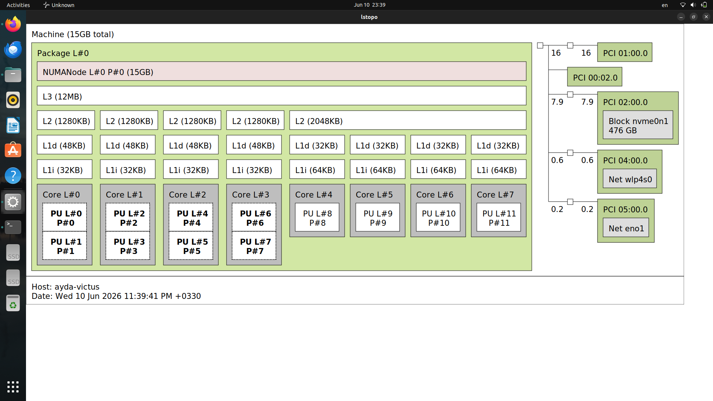

The environment utilizes a hybrid processor architecture featuring $12$ Processing Units (PUs) and $15$ GB of RAM unified under a single NUMA node. The core configuration is as follows:

- **Performance Cores (P-Cores):** $4$ physical cores (Core L0 to L3). Each core possesses a dedicated L2 cache ($1280$ KB) and supports Hyper-Threading, providing a total of $8$ logical processors (PU $0$ to PU $7$).
- **Efficient Cores (E-Cores):** $4$ physical cores (Core L4 to L7) without Hyper-Threading (providing $4$ logical processors: PU $8$ to PU $11$). These cores share a single, unified L2 cache ($2048$ KB).
- **Shared L3 Cache:** A $12$ MB Level $3$ cache shared uniformly across all P-Cores and E-Cores.

### Hardware Performance Counters & Metric Selection

The selected events with the `u/` suffix (User-space) measure various aspects of CPU performance:
- `cycles/u` & `instructions/u`: CPU cycles and executed instructions (used to calculate IPC and core efficiency).
- `L1-dcache-loads/u`: L1 data cache accesses, indicating the volume of data processing.
- `L1-icache-load-misses/u`: L1 instruction cache misses, showing delays in instruction fetching.
- `LLC-loads/u` & `LLC-load-misses/u`: Last Level Cache (L3) accesses and misses. LLC misses result in high-latency RAM access.
- `dTLB-loads/u` & `dTLB-load-misses/u`: Data TLB performance in virtual-to-physical address translation.
- `branch-misses/u`: Branch prediction failures causing pipeline flushes.
- `cs:u` & `page-faults:u`: Context switches and page faults to monitor OS-level interruptions.

> **Note on Precision:** CPUs feature a limited number of Hardware Performance Counters. Requesting too many simultaneous events forces `perf` to use Time Multiplexing, resulting in estimated values (indicated by $<100\%$ time coverage). By splitting the events into two distinct groups, it was ensured that the hardware counter limits were not exceeded, guaranteeing that all metrics were recorded with $100\%$ absolute precision, eliminating statistical estimations.

---

## Overall Purpose of the Scenarios

The primary goal of these $4$ scenarios is to evaluate the scalability and architectural behavior of Memcached under varying workloads. 

### Summary of the 4 Scenarios

- **Scenario A (1 Server vs 1 Client - 1v1):** The Baseline. Evaluates Memcached’s raw single-thread performance without any inter-thread synchronization overhead or contention.
- **Scenario B (1 Server vs 4 Clients - 1v4):** Single-thread Stress Test. Pushes a single Memcached thread to its absolute limits by generating heavy concurrent load from multiple client cores to identify the bottleneck point.
- **Scenario C (4 Servers vs 1 Client - 4v1):** Synchronization Overhead Test. Tests how a multi-threaded Memcached server behaves under a light load. It helps identify overheads caused by thread locking and internal management when parallel processing isn’t strictly necessary.
- **Scenario D (4 Servers vs 4 Clients - 4v4):** Full Scalability Test. Evaluates Memcached’s true parallel processing capabilities under heavy load, revealing how well it scales across multiple P-Cores and how it utilizes the shared L3 cache.

---

## Scenario 1: 1 Server Thread vs. 1 Client Thread (1v1)

### Step 1: Initializing the Memcached Server (Terminal 1)

```bash
taskset -c 2 memcached -o 11211 -t 1 -u root
```

We start the Memcached server as the root user on port $11211$, strictly limiting it to a single thread (`-t 1`).
- **CPU Topology Context:** We used `taskset -c 2` to pin the process to Processing Unit (PU) $2$. According to our hardware topology (`lstopo`), PU $2$ is located on Core L$1$, which is a Performance Core (P-Core). Pinning the process ensures cache locality (L1/L2 caches) and prevents the OS scheduler from migrating the process, which would pollute the CPU cache.

### Step 2: Generating Load with Memtier Benchmark (Terminal 4)

```bash
taskset -c 8 memtier_benchmark -s 127.0.0.1 -p memcache_binary -t 1 -c 50 -n 100000 --ratio=1:1 --key-pattern=R:R
```

This command launches the client to simulate traffic. It creates $1$ thread (`-t 1`) with $50$ connections, sending $100,000$ requests per connection with an equal Read/Write ratio (`--ratio=1:1`).
- **CPU Topology Context:** We pinned the client to CPU $8$ (`taskset -c 8`). Based on the topology, PU $8$ is located on Core L4, which is an Efficient Core (E-Core). By placing the client on a completely isolated physical core and a different core cluster, we guarantee that the load generator does not compete with Memcached for L1/L2/L3 caches or CPU cycles.

### Step 3: Hardware Event Counting (Terminal 2)

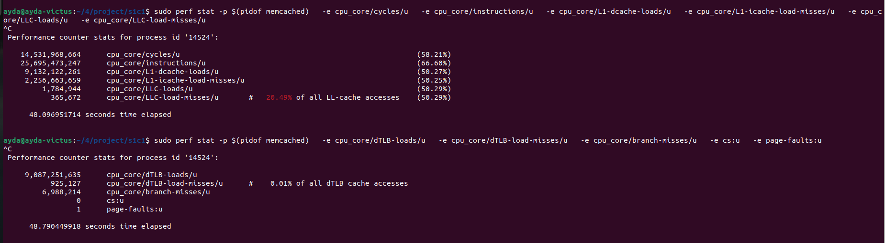

While the benchmark was running, we executed `perf stat` sequentially to count exact hardware events.

### Step 4: Profiling with Perf Record

Simultaneously (in another test run), we captured profiling data using `perf record` to map the events to source code functions via frame pointers (`--call-graph fp`).

---

## FlameGraph Analysis (1v1 Scenario)

### 1. CPU Cycles Analysis

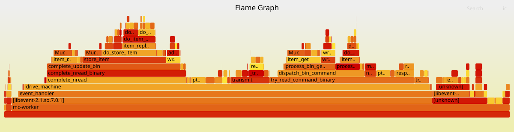
- **Main Hotspot:** The `drive_machine` function, leading into `process_command` and `assoc_find`.
- **Reason & Functionality:** Memcached uses an event-driven architecture. `drive_machine` is the core event loop. The CPU spends most of its time in `process_command` (parsing client requests like GET/SET) and `assoc_find` (looking up the key in the hash table). This is a sign of a healthy architecture where CPU cycles are spent on the core business logic rather than overhead.

### 2. Last Level Cache (LLC) Misses Analysis

[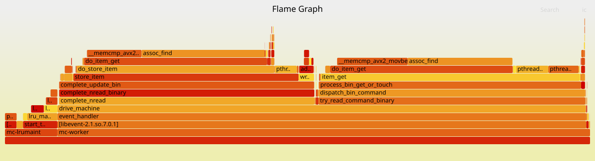](https://raw.githack.com/Ayda-R/memcached-benchmark/refs/heads/main/images4/multi-thread/1flame_cache_cpu_core_LLC-load-misses_u.svg)
- **Main Hotspot:** The `assoc_find` function.
- **Reason & Functionality:** `assoc_find` traverses the large Memcached hash table. Due to the random access nature of key lookups, the required memory addresses are rarely found in the CPU’s Last-Level Cache (L3). This results in Cache Misses, forcing the CPU to fetch data directly from the slower Main Memory (RAM), which is the primary performance bottleneck for in-memory stores.

### 3. Data TLB Misses Analysis

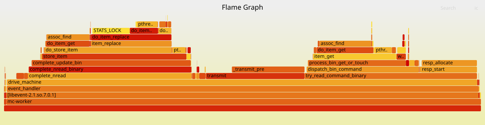
- **Main Hotspot:** Item retrieval (`do_item_get`) and lookup functions (`assoc_find`).
- **Reason & Functionality:** The TLB (Translation Lookaside Buffer) is a small cache for virtual-to-physical address translations. Because Memcached accesses scattered memory locations (different memory pages) across a huge memory pool, the TLB capacity is frequently exceeded. TLB misses force the CPU to perform costly Page Table Walks, adding OS-level overhead to memory lookups.

---

## Scenario 2: 1 Server Thread vs. 4 Client Threads (1v4)

In this scenario, the goal is to evaluate the performance of a single server core (Memcached) under high load generated by multiple client threads.

### Server Setup (Terminal 1)

```bash
taskset -c 2 memcached -o 11211 -t 1 -u root
```

Existing services were stopped first. Then, Memcached was launched using `taskset` pinned strictly to logical processor $2$ with a single thread (`-t 1`).
- Core number $2$ is a Performance Core (P-Core). We pin the server here to ensure it gets maximum processing power and full access to the large L3 cache.

### Client Setup (Terminal 4)

```bash
taskset -c 8,9,10,11 memtier_benchmark -s 127.0.0.1 -p memcache_binary -t 4 -c 50 -n 100000 --ratio=1:1 --key-pattern=R:R
```

The `memtier_benchmark` tool was executed with $4$ threads (`-t 4`) and pinned to logical processors $8$, $9$, $10$, and $11$.
- Cores $8$ through $11$ are Efficiency Cores (E-Cores). By placing the client threads on these cores, we completely isolate the load generator from the server. This prevents resource contention and ensures the clients do not pollute the P-Core’s cache or steal CPU cycles from the server.

### Gathering Overall Stats with `perf stat` (Terminal 2)

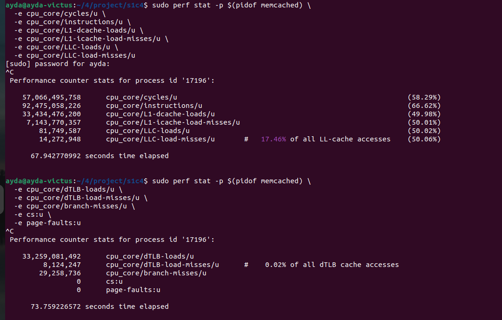

Concurrently with the benchmark, `perf stat` was attached to the Memcached Process ID. It was run in two separate groups to collect overall hardware event statistics (such as CPU cycles, cache misses, and TLB misses) during the benchmark run.

### Profiling Events with `perf record` (Terminal 3)

To generate FlameGraphs later, `perf record` was used to capture detailed call graphs. To avoid time-multiplexing inaccuracies due to limited hardware performance counters, this command was executed in two separate runs: one for CPU/Cache events and another for TLB/OS events.

### FlameGraph Analysis (1v4 Scenario)

#### Last Level Cache Misses - The Memory Wall
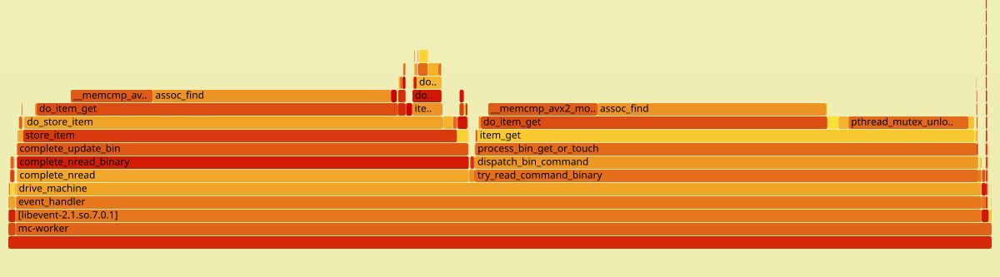

Memcached is inherently a memory-bound application. Under heavy concurrent load, the cache hit rate drops, leading to LLC misses. The FlameGraph reveals that `assoc_find` (the hash table lookup function) is the major victim here. The unpredictable and non-sequential access patterns to the large hash table and memory chunks cause the CPU to stall while fetching data from the main memory (RAM).

#### Data TLB Misses - Translation Overhead
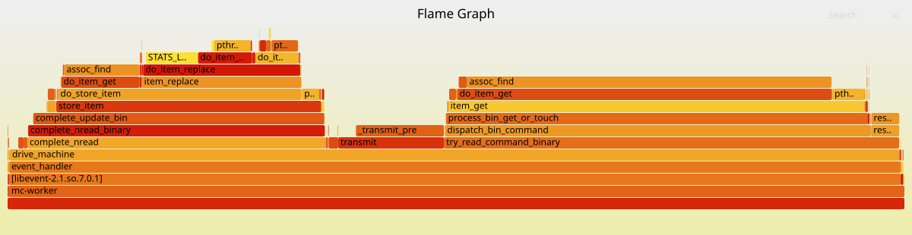

With a massive number of random memory accesses, the Translation Lookaside Buffer (TLB) struggles to cache all necessary page translations. This graph highlights the overhead of “Page Table Walks” performed by the OS. The high rate of dTLB misses confirms that memory fragmentation and sparse data access patterns in Memcached severely impact address translation efficiency under load.

#### Branch Misses - Pipeline Stalls
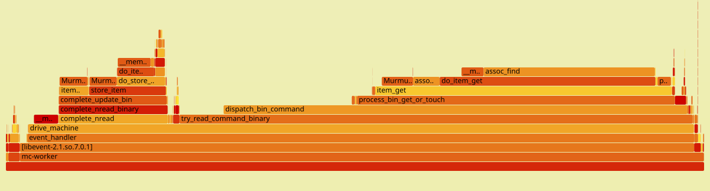

High concurrency introduces unpredictable execution paths, especially during command parsing and state machine transitions in `drive_machine`. Branch prediction failures cause pipeline flushes, wasting CPU cycles. Optimizing conditional checks in the hot paths could theoretically reduce this overhead, though it is a common characteristic of complex network servers.

---

## Scenario 3: Multi-Threaded Server (4 Threads) vs Isolated Client (4v1)

This scenario evaluates the performance of Memcached when utilizing multiple worker threads, with strict CPU affinity to isolate the server from the load generator.

### Server Initialization (Terminal 1)
```bash
taskset -c 0,2,4,6 memcached -o 11211 -t 4 -u root
```

We start the Memcached instance with $4$ worker threads (`-t 4`). Using `taskset`, we pin the process to CPU cores $0$, $2$, $4$, $6$. Based on the Intel hybrid topology, these are independent Performance Cores (P-Cores). Pinning to specific physical P-Cores avoids Hyper-Threading contention (by skipping SMT sibling cores like $1$, $3$, $5$, $7$) and prevents context-switching overhead, ensuring maximum processing power and cache locality for the server.

### Client Load Generation (Terminal 4)
```bash
taskset -c 8 memtier_benchmark -s 127.0.0.1 -p memcache_binary -t 1 -c 50 -n 100000 --ratio=1:1 --key-pattern=R:R
```

The `memtier_benchmark` client is launched with $4$ threads to generate high traffic. It is pinned to CPU cores $8$, $9$, $10$, $11$. In our topology, these represent the Efficiency Cores (E-Cores). This strict isolation guarantees that the load generator does not interfere with the server’s P-Cores, preventing Resource Contention and ensuring benchmark accuracy.

### Hardware Performance Counters `perf stat` (Terminal 2)
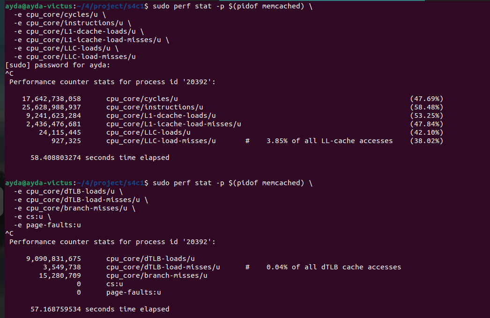

Concurrently with the benchmark, we run `perf stat -p $(pidof memcached)` to monitor the running server process. The command is split into two executions to capture hardware events without multiplexing issues:
1. Cache & Core metrics (cycles, instructions, L1/LLC loads and misses).
2. TLB & OS metrics (dTLB misses, branch-misses, page-faults).

### Call Graph Profiling `perf record` (Terminal 3)

To generate FlameGraphs for deep function-level analysis, we use `perf record -p $(pidof memcached) -g --call-graph fp`. This samples the call stack of the application. Like `perf stat`, it is executed in two separate runs to group relevant events:
- Captures cache-related events and outputs to `perf_cache.data`.
- Captures TLB/Branch events and outputs to `perf_tlb_os.data`.

### FlameGraph Analysis (4v1 Scenario)

#### CPU Cycles
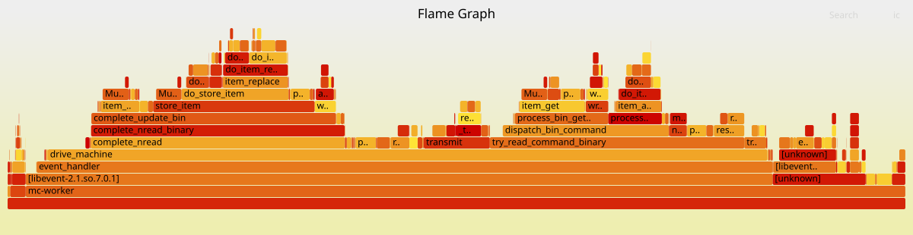
- **Importance:** This graph represents the overall execution time and is the fundamental baseline for understanding where the CPU spends its time.
- **Main Hotspot:** `drive_machine` and `event_base_loop`.
- **Reason & Analysis:** Memcached is an event-driven application. The `drive_machine` function is the core state machine handling the lifecycle of every client connection. A vast majority of CPU cycles are spent here and in `process_command` (parsing requests). High utilization here is expected, indicating that optimizing command parsing yields the most significant CPU performance gains.

#### LLC Misses
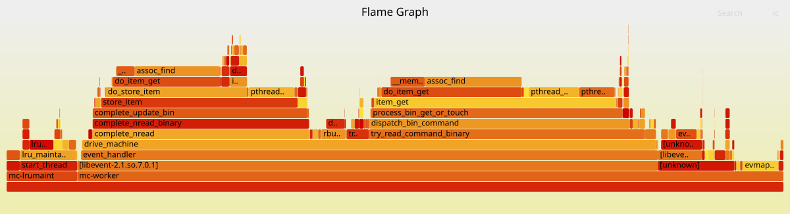
- **Importance:** For data-intensive applications like Memcached, main memory access is the primary bottleneck (the Memory Wall). This graph highlights where data was not found in the L3 cache.
- **Main Hotspot:** `assoc_find` and `item_get`.
- **Reason & Analysis:** The `assoc_find` function is responsible for hash table lookups. Because the hash table relies on arrays of pointers and linked lists scattered across memory (pointer chasing), the CPU’s hardware prefetcher cannot easily predict memory access patterns. This random access behavior leads to significant Last Level Cache (LLC) misses.

#### dTLB Misses
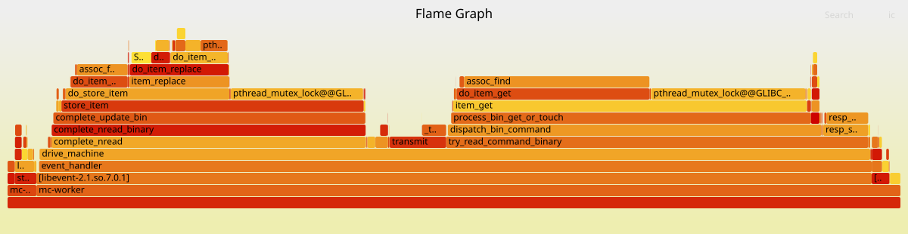
- **Importance:** This graph illustrates the system overhead incurred when translating virtual memory addresses to physical ones.
- **Main Hotspot:** Memory management and hash lookup functions like `assoc_find`.
- **Reason & Analysis:** Memcached uses a custom Slab Allocator. With large datasets, the random memory access patterns (similar to LLC misses) cause the CPU to fail at finding virtual addresses in the TLB cache. This forces the OS to perform expensive Page Table Walks. Enabling Huge Pages is the standard optimization to mitigate this bottleneck.

---

## Scenario 4: Full Scalability Test (4v4)

### Starting the Memcached Server (Terminal 1)
```bash
taskset -c 0,2,4,6 memcached -o 11211 -t 4 -u root
```

First, we stopped any running memcached services (`systemctl stop` and `killall`), then executed the following command:
Using `taskset`, we pinned the memcached process to CPUs $0$, $2$, $4$, $6$. The port is set to $11211$, and we used the `-t 4` flag to run memcached with $4$ threads.
According to the system topology, cores $0$, $2$, $4$, and $6$ are Performance Cores (P-Cores). We placed the $4$ server threads exactly on $4$ dedicated P-Cores to ensure the server has maximum processing power to handle concurrent requests and to prevent thread migration.

### Launching the Client (Terminal 4)
```bash
taskset -c 8,9,10,11 memtier_benchmark -s 127.0.0.1 -p memcache_binary -t 4 -c 50 -n 100000 --ratio=1:1 --key-pattern=R:R
```

To generate traffic load, we executed the `memtier_benchmark`. This runs a benchmark using $4$ threads (`-t 4`), $50$ connections per thread (`-c 50`), and $100,000$ requests per client.
Cores $8$, $9$, $10$, and $11$ are Efficient Cores (E-Cores) in this topology. By pinning the client to E-Cores, we completely isolated the client and server at the hardware level. This prevents resource contention, ensuring that the profiling results for the server are accurate and noise-free.

### Statistics with `perf stat` (Terminal 2)
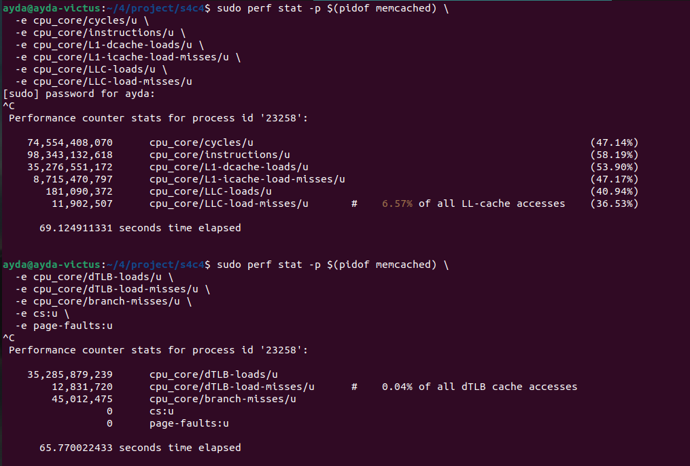

Simultaneously with the benchmark, we ran `perf stat` attached to the memcached PID in this terminal. The command was executed in two separate groups to avoid hardware counter multiplexing. The overall results, including cycle counts, instructions, cache misses, and TLB misses, are visible in the screenshot, providing a high-level hardware summary during the test.

### Recording Events with `perf record` (Terminal 3)

While the load was being generated, we captured detailed profiling data in this terminal to generate FlameGraphs:
Command Explanation: `perf record -p $(pidof memcached)` attaches to the memcached process. The `-e` flag specifies the target events (split into Cache/Core and TLB/OS groups). The critical part is `-g --call-graph fp`, which records the call stacks using frame pointers, enabling us to build accurate FlameGraphs. The output is saved to `.data` files (e.g., `perf_cache.data`).

### FlameGraph Analysis (4v4 Scenario)

#### CPU Cycles
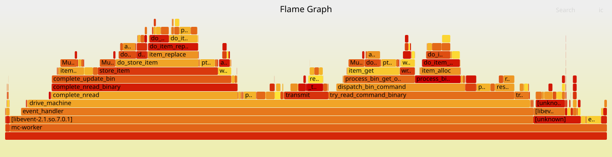
This graph provides the baseline overview of where the CPU spends its actual execution time. It shows the overall cost of functions.
- **Main Hotspot:** `drive_machine`
- **Why it’s dominant:** This is the core state machine and event loop of Memcached. Every network event, client connection, and command parsing goes through this function. Under high load (like 4v4 scenarios), managing the state of thousands of concurrent connections keeps the CPU constantly busy executing instructions within this loop.

#### LLC Misses
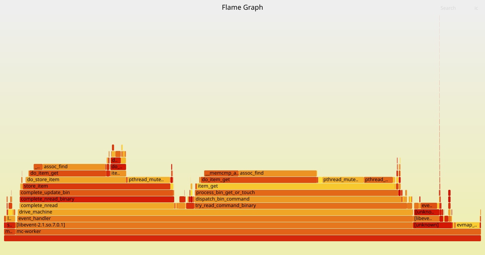
Memcached is an in-memory key-value store. Its performance is heavily bound by memory access latency (the “Memory Wall”). LLC misses indicate that data wasn’t in the CPU cache and had to be fetched from the much slower main RAM.
- **Main Hotspot:** `assoc_find`
- **Why it’s dominant:** The function responsible for looking up keys in Memcached’s internal Hash Table. Hash tables inherently have random memory access patterns. When a key is searched, the CPU tries to fetch the bucket from memory. Since these accesses are scattered, hardware prefetchers fail, leading to massive Last Level Cache (LLC) misses. The CPU stalls while waiting for RAM.

#### dTLB Misses
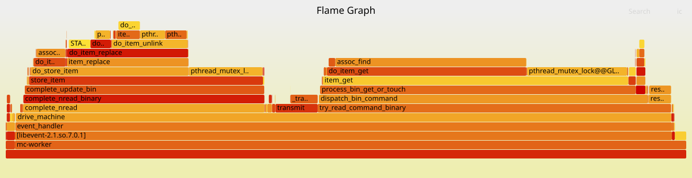
The TLB (Translation Lookaside Buffer) is a small cache in the CPU that speeds up virtual-to-physical memory address translation. High TLB misses show severe Operating System overhead due to Page Table Walks.
- **Main Hotspot:** `assoc_find` / Memory Allocators
- **Why it’s dominant:** Again, hash table lookups (`assoc_find`) and memory management operations. Because Memcached accesses many different memory pages randomly, the CPU cannot cache all the page translations in the TLB. Every time a TLB miss occurs, the CPU must ask the OS to walk the page tables to find the physical address, adding significant latency on top of the actual memory fetch.

---

## Performance Analysis and Scenario Comparison

| Event | Scenario A (1server&1client) | Scenario B (1server&4clients) | Scenario C (4servers&1client) | Scenario D (4servers&4clients) |
|-------|----------------|----------------|----------------|----------------|
| `cycles` | $14,531,968,664$ | $57,066,495,758$ | $17,642,738,058$ | $74,554,408,070$ |
| `instructions` | $25,695,473,247$ | $92,475,058,226$ | $25,628,988,937$ | $98,343,132,618$ |
| `L1-dcache-loads` | $9,132,122,261$ | $33,434,476,200$ | $9,241,623,284$ | $35,276,551,172$ |
| `L1-icache-load-misses`* | $2,256,663,659$ | $7,143,770,357$ | $2,436,476,681$ | $8,715,470,797$ |
| `LLC-loads` | $1,784,944$ | $81,749,587$ | $24,115,445$ | $181,090,372$ |
| `LLC-load-misses` | $365,672$ | $14,272,948$ | $927,325$ | $11,902,507$ |
| `dTLB-loads` | $9,087,251,635$ | $33,259,081,492$ | $9,090,831,675$ | $35,285,879,239$ |
| `dTLB-load-misses` | $925,127$ | $8,124,247$ | $3,549,738$ | $12,831,720$ |
| `branch-misses` | $6,988,214$ | $29,258,736$ | $15,280,709$ | $45,012,475$ |
| **IPC** (ins/cycle) | $1.77$ | $1.62$ | $1.45$ | $1.32$ |
| **LLC miss rate** | $20.49\%$ | $17.46\%$ | $3.85\%$ | $6.57\%$ |
| **dTLB miss rate** | $0.0102\%$ | $0.0244\%$ | $0.0391\%$ | $0.0364\%$ |

In this section, we analyze the system’s behavior across $4$ different scenarios (various combinations of server and client threads). The key factor in this analysis is that client threads determine the load and incoming traffic to the server.

- **Impact of Client Traffic on Processing Volume (instructions and cycles):**
  In scenarios s1c1 and s4c1 (where there is only $1$ client thread), the number of executed instructions in both cases is around $25$ billion. This indicates that simply increasing server threads has no impact since the workload is light, causing the server to experience underutilization. By increasing client threads to $4$ (s1c4 and s4c4), the generated traffic surges drastically, causing CPU instructions to jump to over $92$ - $98$ billion. In s4c4, we observe the highest cycle consumption ($74$ billion), reflecting the parallel activity of all $4$ server threads working at maximum capacity to serve requests.

- **Load Distribution Optimization and Cache Miss Reduction (LLC-load-misses):**
  One of the most critical findings is the behavior of the Last Level Cache (LLC) miss rate. When the server has only $1$ thread (s1c1 at $20.49\%$ and s1c4 at $17.46\%$), the miss rate is significantly high. This means a single thread is accessing a massive volume of memory, causing Cache Thrashing. When server threads are increased to $4$ threads (s4c1 and s4c4), the miss rate drops dramatically to single digits ($3.85\%$ and $6.57\%$). The reason is the distribution of the workload and data structures (like hash tables) across $4$ physical cores (P-Cores). Each core handles a smaller subset of data, leading to better data retention in the cache and a significantly higher Cache Hit Ratio.

- **Level 1 Cache (L1-dcache-loads) and dTLB Behavior:**
  L1 cache loads are directly correlated with instruction counts and increase by approximately $3$ to $4$ times in high-client scenarios. Data TLB misses (dTLB-load-misses) remain below $0.05\%$ across all scenarios. This demonstrates that the OS handles memory page management extremely well, although in s4c4, due to memory access scattering under high traffic, the raw count of these misses peaks ($12$ million).

- **Branch Prediction Challenges (branch-misses):**
  In the maximum traffic scenario (s4c4), branch misses reach their peak ($45$ million). Processing multiple network connections concurrently and frequent changes in Memcached’s state machine make the application’s behavior highly unpredictable, leading to more failures in the CPU’s Branch Predictor mechanism.

---

## Scenario: Performance Analysis under Different Read/Write Workloads (Set:Get Ratios)

### Objective and Purpose
The goal of this scenario is to evaluate Memcached’s performance and architectural behavior under varying workload characteristics. Real-world applications rarely have a static access pattern; therefore, testing different set (write) to get (read) ratios is crucial to understand system bottlenecks.

We test three specific ratios:
1. **$10:90$ ($10\%$ Set, $90\%$ Get):** Simulates a typical read-heavy caching workload (e.g., serving static content, user profiles). This tests the efficiency of the hash table lookups and cache hits.
2. **$50:50$ ($50\%$ Set, $50\%$ Get):** Simulates a balanced workload. This tests the system’s ability to handle frequent cache invalidations and memory allocations simultaneously with read requests.
3. **$90:10$ ($90\%$ Set, $10\%$ Get):** Simulates a write-heavy workload (e.g., session management, real-time analytics). This puts heavy stress on memory allocation, eviction policies (LRU), and internal locking mechanisms.

### Server Setup (Terminal 1)
This setup remains constant across all three ratio tests.
To ensure isolated and accurate profiling, we first stop any background instances of Memcached and then launch our custom-compiled version pinned to a specific CPU core.
Command executed in Terminal 1:
```bash
taskset -c 2 memcached -o 11211 -t 1 -u root
```

---

### 1. Balanced Workload (50:50 Set:Get Ratio) - Workflow and Execution
After starting the Memcached server, we utilize two additional terminals to generate the specific workload and simultaneously profile the server’s hardware events.

**Client Setup & Load Generation:**
To simulate a balanced workload where read and write operations are equal, we execute the `memtier_benchmark` tool in Terminal 3.
```bash
taskset -c 8,9,10,11 memtier_benchmark -s 127.0.0.1 -p memcache_binary -t 4 -c 50 -n 100000 --ratio=1:1 --key-pattern=R:R
```

**Concurrent Performance Profiling:**
Exactly while the benchmark is running, we execute `perf stat` commands in Terminal 2 to capture the hardware performance counters of the Memcached process.
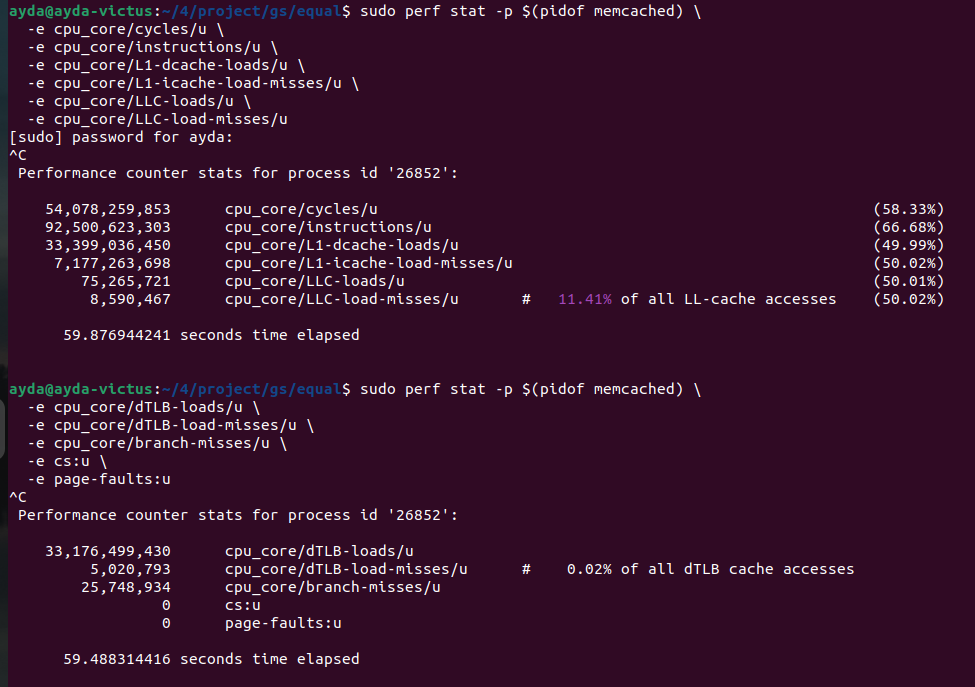

---

### 2. Read-Heavy Workload (1:9 Set:Get Ratio) - Workflow and Execution
After establishing the Memcached server (pinned to P-Core $2$), we use the remaining terminals to generate a read-intensive workload and concurrently profile the server’s hardware events and execution graphs.

**Client Setup & Load Generation:**
To simulate a workload predominantly consisting of read operations ($90\%$ reads, $10\%$ writes), we execute the `memtier_benchmark` tool.
```bash
taskset -c 8,9,10,11 memtier_benchmark -s 127.0.0.1 -p memcache_binary -t 4 -c 50 -n 100000 --ratio=1:9 --key-pattern=R:R
```

**Concurrent Performance Profiling:**
While the read-heavy benchmark is actively running, we capture both high-level statistical counters and deep-level execution graphs. We use `perf stat` to capture aggregated hardware performance metrics during the workload execution.
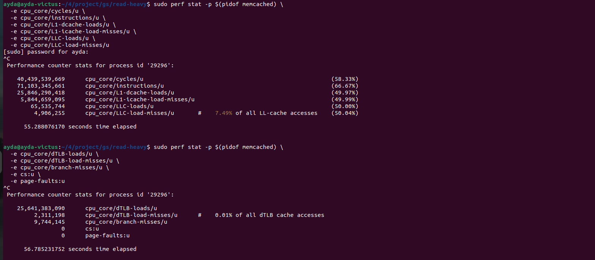

---

### 3. Write-Heavy Workload (9:1 Set:Get Ratio) - Workflow and Execution
After establishing the Memcached server (pinned to P-Core $2$), we use the remaining terminals to generate a write-intensive workload and concurrently profile the server’s hardware events and execution graphs.

**Client Setup & Load Generation:**
To simulate a workload predominantly consisting of write operations ($90\%$ writes, $10\%$ reads), we execute the `memtier_benchmark` tool.
```bash
taskset -c 8,9,10,11 memtier_benchmark -s 127.0.0.1 -p memcache_binary -t 4 -c 50 -n 100000 --ratio=9:1 --key-pattern=R:R
```

**Concurrent Performance Profiling:**
While the write-heavy benchmark is actively running, we capture both high-level statistical counters and deep-level execution graphs. We use `perf stat` to capture aggregated hardware performance metrics during the workload execution.
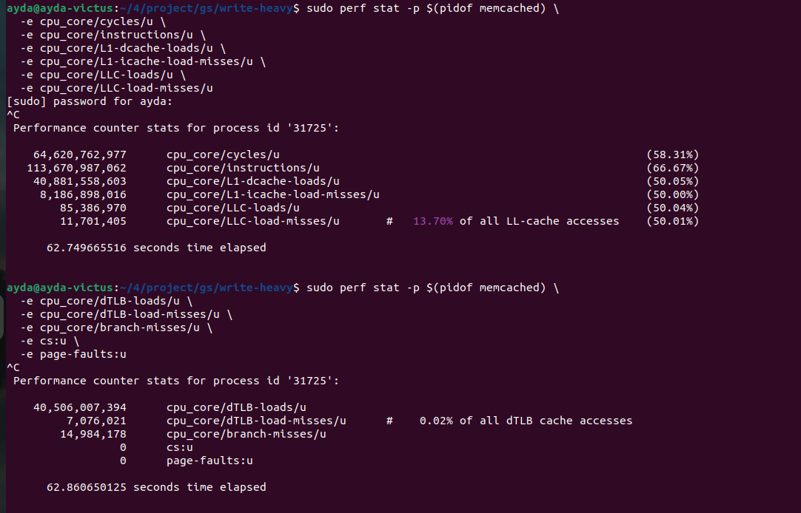

---

### Set:Get Ratios Performance Summary

| Event | Read-Heavy (1:9) | Equal/Balanced (1:1) | Write-Heavy (9:1) |
| :--- | :--- | :--- | :--- |
| `cycles` | $40,439,539,669$ | $54,078,259,853$ | $64,620,762,977$ |
| `instructions` | $71,103,345,661$ | $92,500,623,303$ | $113,670,987,062$ |
| `L1-dcache-loads` | $25,846,290,418$ | $33,399,036,450$ | $40,881,558,603$ |
| `L1-icache-load-misses` | $5,844,659,095$ | $7,177,263,698$ | $8,186,898,016$ |
| `LLC-loads` | $65,535,744$ | $75,265,721$ | $85,386,970$ |
| `LLC-load-misses` | $4,906,255$ | $8,590,467$ | $11,701,405$ |
| `dTLB-loads` | $25,641,383,090$ | $33,176,499,430$ | $40,506,007,394$ |
| `dTLB-load-misses` | $2,311,198$ | $5,020,793$ | $7,076,021$ |
| `branch-misses` | $9,744,145$ | $25,748,934$ | $14,984,178$ |
| **LLC miss rate** | $7.49\%$ | $11.41\%$ | $13.70\%$ |
| **dTLB miss rate** | $0.01\%$ | $0.02\%$ | $0.02\%$ |

### Hardware Event Analysis across Set:Get Ratios

This section analyzes the impact of different Read/Write ratios on the CPU and memory subsystem using `perf stat` hardware counters. The tests cover Read-Heavy ($10\%$ SET, $90\%$ GET), Balanced ($50\%$ SET, $50\%$ GET), and Write-Heavy ($90\%$ SET, $10\%$ GET) workloads.

#### 1. Computational Overhead (Cycles & Instructions)
There is a clear, linear increase in both `cycles/u` and `instructions/u` as the workload shifts from read-heavy to write-heavy.
- **Reason:** In Memcached, a GET operation is relatively inexpensive, primarily involving a hash table lookup. Conversely, a SET operation requires memory allocation (slab allocator), hash table updates, locking mechanisms, and potentially LRU eviction logic. This inherent complexity results in the Write-Heavy scenario executing roughly $60\%$ more instructions than the Read-Heavy scenario.

#### 2. Cache Hierarchy Performance (L1 & LLC)
- **L1 Cache:** `L1-dcache-loads` scale proportionally with the number of instructions executed. The higher computational demand of SET operations naturally drives more frequent L1 data cache accesses.
- **Last Level Cache (LLC):** The `LLC-load-misses/u` rate reveals a significant trend, increasing from $7.49\%$ (Read-Heavy) to $13.70\%$ (Write-Heavy).
- **Reason:** Read-heavy workloads benefit from high temporal locality; repeatedly accessing the same set of “hot” keys keeps them populated in the LLC. Write-heavy workloads constantly introduce new data (and potentially evict old data), fetching new memory addresses that are not currently cached, thereby significantly increasing the LLC miss rate.

#### 3. Memory Translation (dTLB)
While the absolute number of `dTLB-loads` increases alongside L1 cache accesses, the `dTLB-load-misses/u` rate remains exceptionally low across all scenarios ($0.01\%$ to $0.02\%$).
- **Reason:** This indicates that the operating system’s page tables and Memcached’s memory management are highly efficient, likely benefiting from HugePages or optimal slab allocation, preventing memory translation from becoming a bottleneck even under heavy write pressure.

#### 4. Branch Predictability
Interestingly, `branch-misses/u` peaks in the Balanced (1:1) scenario (approx. $25.7$ million) rather than the Write-Heavy scenario (approx. $14.9$ million).
- **Reason:** Modern CPU branch predictors excel at recognizing consistent patterns (like executing mostly GET paths or mostly SET paths). The Balanced scenario presents a randomized $50/50$ split of read and write requests, breaking predictable execution flows and forcing the CPU’s branch predictor to miscalculate more frequently compared to the more homogenous Read-Heavy and Write-Heavy extremes.
